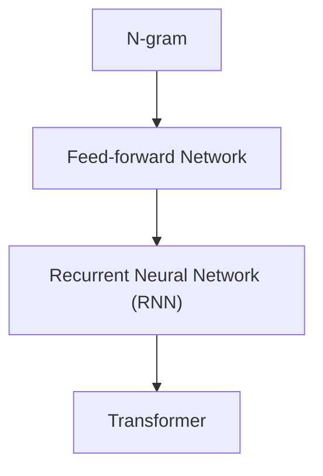

我们[[001.什么是生成式 AI#ChatGPT 也就是个函式|之前]]讲过语言模型就是一个拥有很多参数的函式，这个函数是一个类神经网络，语言模型最常见的就是类神经网络的一种：Transformer

当然模型也不是一开始就使用 Transformer，是有一个演进过程：

注意：本课程会对 Transformer 的说明进行大量简化

# Transformer 概述

![[Pasted image 20250803114708.png]]

## 1. 把文字变成 Token

语言模型是以 Token 作为单位来对文字进行处理

![[Pasted image 20250803132838.png]]

- Token 是依据什么切分的？先准备一个根据语言的理解指定的 Token list，不同的语言模型处理不同的语言的 Token list 是不一样的
- Token list 也可以自动取得，Byte Pair Encoding (BPE) 算法可以从大量文字中找出常常出现的 Token，[学习资料](https://huggingface.co/learn/llm-course/chapter6/5)

[ChatGPT 的 tokenizer](https://platform.openai.com/tokenizer)：

![[Pasted image 20250803133151.png]]

## 2. 理解每个 Token

### 语义

![[Pasted image 20250803133706.png]]

- 每个 Token 用一个向量看表示，Token -> 向量的过程叫做==嵌入 (Embedding)==
- 原本每一个 Token 都是独立的符号，Embedding 后语义相近的 Token 会有接近的向量距离

![[Pasted image 20250803134033.png]]

- 如何知道 Token 对应的向量？查表，Token Embedding 表是在训练时得到的。每个 Token 对应的向量就是语言模型要找的未知参数之一
- 但是有一个问题，这些 Token 没有考虑上下文。如 bank 有“银行”和“河岸”两个意思，单个 Token 无法确定语义

### 位置

除了语义还需要考虑位置的信息，需要知道每个 Token 在句子里的哪个位置。因为同一个 Token 在不同的位置可能会有不同的语义。需要把位置信息加到 Embedding 向量中

![[Pasted image 20250803134622.png]]

- 将位置也表示为向量，每个 Embedding 向量存储 Token 的向量和位置的向量
- 位置的向量叫做 Positional Embedding，可以由人类指定，或者训练时得到

## 3. Attention：考虑上下文

![[Pasted image 20250803135434.png]]

- 不考虑上下文时“苹果电脑”和“吃苹果”的“果”的 Token Embedding 都是一模一样的
- 但在经过 Attention 之后，Attention 会考虑整个句子的上下文，Embedding 就会变的不一样
- 这种有考虑上下文叫做 Contextualized Token Embedding

[Attention Is All You Need](https://arxiv.org/abs/1706.03762) 发现不需要 Recurrent Neural Network (RNN)，只需要 Attention 就够了

### Attention 是如何运作的

输入一些向量，经过 Attention 后输出相同长度的向量（将上下文的信息加进向量中）
