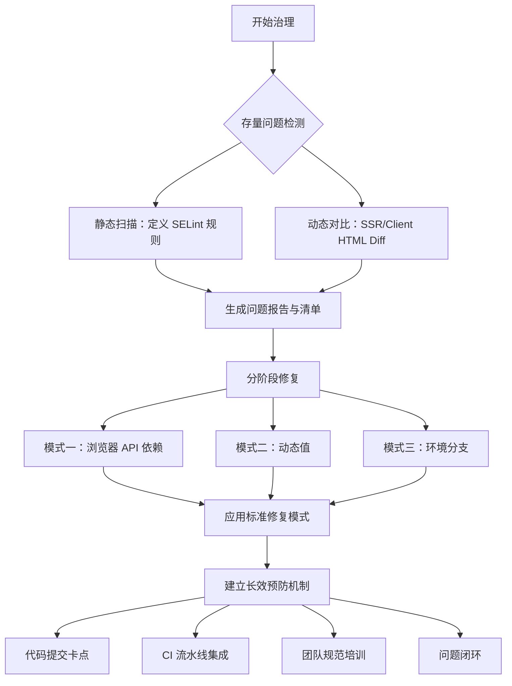

# 问题背景与目标

## 问题背景

在采用服务端渲染（SSR）或静态站点生成（SSG）的 React 应用（如 Next.js、Remix）中，**Hydration** 是连接服务器渲染的 HTML 与客户端 React 代码的关键过程。当服务器与客户端渲染的组件树或文本内容不一致时，React 会抛出 **“Hydration failed because the server rendered HTML didn't match the client”** 错误，并触发昂贵的客户端重新渲染，导致：

1. **性能损耗**：完全客户端重新渲染，失去SSR的性能优势
2. **用户体验下降**：页面可能出现闪烁、布局偏移或交互响应延迟
3. **开发体验受损**：错误难以追踪，尤其在复杂应用中

## 常见根因

根据官方文档与社区实践，主要诱因包括：

- **环境判断差异**：在组件渲染逻辑中直接使用 `if (typeof window !== 'undefined')` 进行分支
- **动态或非确定性值**：在渲染中直接使用 `Date.now()`、`Math.random()` 或未从服务器同步的用户本地时间格式化
- **浏览器 API 依赖**：在组件渲染函数中直接访问 `window`、`document`、`localStorage` 等仅在客户端存在的对象
- **数据不一致**：客户端初始化数据与服务器传递的`props`或`snapshot`不匹配
- **无效的 HTML 嵌套**：服务器生成的 HTML 结构不符合规范，被浏览器自动纠正，导致与客户端 DOM 不匹配

## 治理目标

1. **检测**：通过自动化工具，无遗漏地识别出项目中所有可能导致 Hydration 不匹配的**存量代码**
2. **修复**：提供标准化的修复模式与辅助工具，高效、正确地修复问题
3. **预防**：建立编码规范和卡点流程，杜绝**新增代码**引入同类问题

# 技术方案

本方案遵循 **“静态检测 → 动态验证 → 标准修复 → 长效预防”** 的闭环路径，覆盖研发全流程



## 阶段一：存量问题检测（自动化）

### 静态代码分析（自定义 ESLint 规则）

由于社区暂无直接检测 Hydration 风险的完整规则包，需开发项目级自定义规则

**规则包名称**：`eslint-plugin-react-hydration-ssr`

**检测规则**：

| 规则ID                         | 风险模式                       | 检测示例（违规代码）                                                     | 检测原理                                                                                                      |
| ---------------------------- | -------------------------- | -------------------------------------------------------------- | --------------------------------------------------------------------------------------------------------- |
| `no-browser-api-in-render`   | 在组件函数体顶层或返回 JSX 中调用浏览器 API | `const width = window.innerWidth;` `document.title = '...'`    | 检查 `MemberExpression` 的 `object.name` 是否为 `window`、`document`、`localStorage` 等，且不在 `useEffect` 等安全 Hook 内 |
| `no-dynamic-value-in-render` | 在渲染中使用非确定性函数               | `<div>{Date.now()}</div>` `<div>{Math.random()}</div>`         | 检查 `CallExpression` 的 `callee.name` 是否为 `Date.now`、`Math.random` 等                                        |
| `no-direct-client-branch`    | 直接使用环境判断进行渲染分支             | `if (typeof window !== 'undefined') { return <ClientComp /> }` | 检查 JSX 是否直接位于 `if` 语句的条件分支中，且条件是 `typeof window`、`window` 等                                               |

**配置示例（`.eslintrc.js`）**：

```JavaScript
module.exports = {
  plugins: ['@internal/react-hydration-ssr'],
  rules: {
    '@internal/react-hydration-ssr/no-browser-api-in-render': 'error',
    '@internal/react-hydration-ssr/no-dynamic-value-in-render': 'error',
    '@internal/react-hydration-ssr/no-direct-client-branch': 'error',
  },
};
```

### 动态渲染对比（构建时 HTML Diff）

静态分析无法覆盖数据驱动、第三方库等复杂情况。需补充**构建时动态对比**

**实施方法**：

- 在 CI/CD 流水线中，增加一个特殊的检测构建任务
- 使用无头浏览器（如 Puppeteer）或 Node 环境，对关键路由执行两次渲染：
	1. **SSR 渲染**：在 Node 环境中调用框架的渲染 API
	2. **CSR 模拟渲染**：在同一个 Node 进程中，用 JSDOM 模拟浏览器环境，加载组件并触发 Hydration 后渲染
- 对比两次渲染生成的 HTML 序列（忽略纯样式类属性），产出差异报告

**工具脚本示例**：

```JavaScript
// scripts/hydration-check.js
const { renderToString } = require('react-dom/server');
const { JSDOM } = require('jsdom');
const React = require('react');
const App = require('./dist/server-bundle').default; // 你的应用

async function checkHydration() {
  // SSR 渲染
  const ssrHtml = renderToString(React.createElement(App));
  
  // 在 JSDOM 中模拟客户端 Hydration
  const dom = new JSDOM(`<!DOCTYPE html><html><body><div id="root">${ssrHtml}</div></body></html>`);
  global.window = dom.window;
  global.document = window.document;
  
  // 这里需要加载并执行你的客户端 Bundle，进行 Hydration
  // ... 模拟 Hydration 过程 ...
  
  // 获取 Hydration 后的 HTML
  const csrHtml = document.getElementById('root').innerHTML;
  
  // 简单对比（可使用更专业的 diff 库，如 diffable-html）
  if (ssrHtml !== csrHtml) {
    console.error('❌ Hydration mismatch detected!');
    // 输出差异到报告文件
    require('fs').writeFileSync('hydration-diff.html', generateDiffReport(ssrHtml, csrHtml));
    process.exit(1); // CI 失败
  }
}
checkHydration();
```

## 阶段二：问题修复（标准化模式）

根据检测出的问题模式，制定对应的修复模式，并提供自动化辅助脚本

### 针对“浏览器 API 依赖”

**修复模式**：将依赖浏览器 API 的逻辑移至 `useEffect`、`useLayoutEffect` 或事件处理函数中

- **修复前**：

```JavaScript
function MyComponent() {
  const width = window.innerWidth; // 🚫 违规
  return <div>Width: {width}</div>;
}
```

- **修复后**：

```JavaScript
function MyComponent() {
  const [width, setWidth] = useState(0);
  useEffect(() => {
    setWidth(window.innerWidth); // ✅ 安全
  }, []);
  return <div>Width: {width}</div>;
}
```

### 针对“动态值”

**修复模式**：通过 Props 从服务器传递确定值，或在客户端使用 `useEffect` / `useState` 组合

- **修复前**：

```JavaScript
function Timestamp() {
  return <div>{Date.now()}</div>; // 🚫 每次渲染都不同
}
```

- **修复后**：

```JavaScript
// 服务器组件（如 Next.js App Router）
function Timestamp({ serverTime }) { // ✅ 服务器传递确定值
  return <div>{serverTime}</div>;
}
// 或客户端组件
function Timestamp() {
  const [time, setTime] = useState(null);
  useEffect(() => {
    setTime(Date.now()); // ✅ 仅在客户端设置
  }, []);
  return <div>{time || ''}</div>;
}
```

### 针对“环境分支”

**修复模式**：使用状态和 `useEffect` 延迟渲染客户端特有部分，或使用框架提供的动态导入（`dynamic import`）

- **修复前**：

```JavaScript
function MyComponent() {
  if (typeof window !== 'undefined') { // 🚫 直接分支
    return <HeavyClientChart />;
  }
  return <LoadingSkeleton />;
}
```

- **修复后**：

```JavaScript
import dynamic from 'next/dynamic';
const HeavyClientChart = dynamic(() => import('./HeavyClientChart'), {
  ssr: false, // ✅ 明确不进行 SSR
  loading: () => <LoadingSkeleton />
});
function MyComponent() {
  return <HeavyClientChart />;
}
```

## 阶段三：长效预防机制

### 代码提交卡点（Git Hooks）

在 `pre-commit` 钩子中运行自定义 ESLint 规则，拦截违规代码提交

```Bash
# .husky/pre-commit
npm run lint:hydrate # 运行专项检查
```

### CI/CD 流水线集成

1. **合并请求（MR）检查**：CI 流水线必须运行**静态规则扫描**和**关键页面的动态 Hydration 对比**，失败则阻塞合并
2. **报告可视化**：将 HTML Diff 报告以构件形式上传，在 MR 界面提供链接，方便开发者查看具体不匹配的 DOM 节点

### 团队规范与知识库

1. **编写《SSR 安全开发规范》**：将修复模式、禁止模式纳入团队文档
2. **创建可重用工具与 Hooks**：封装 `useClientOnly`、`useSafeBrowserAPI` 等 Hooks，降低正确模式的使用成本
3. **新成员培训**：将本方案和规范纳入 onboarding 流程

# 具体实现

## 利用 Biome 进行静态代码模式检查

Biome 目前不原生支持类似 ESLint 的自定义规则插件体系，但我们可以通过以下方式实现近似效果：

### 使用 Biome 的 Lint 规则进行基础检查

Biome 内置了一些相关的安全规则，可以在 `biome.json` 中启用

```json
{
  "$schema": "https://biomejs.dev/schemas/1.5.1/schema.json",
  "organizeImports": {
    "enabled": true
  },
  "linter": {
    "enabled": true,
    "rules": {
      "recommended": true,
      "correctness": {
        "noUnsafeOptionalChaining": "error",
        "useExhaustiveDependencies": "warn"
      },
      "suspicious": {
        "noExplicitAny": "warn",
        "noConsoleLog": "off"
      }
    }
  }
}
```

### 创建补充检查脚本（替代自定义规则）

创建一个 Node.js 脚本，使用 Biome 的 API 或简单的 AST 分析来检测 hydration 风险模式

```js
// scripts/check-hydration-patterns.js
import { parse } from '@biomejs/biome';
import { readFileSync, readdirSync } from 'fs';
import { join, extname } from 'path';

// 1. 定义危险模式
const DANGEROUS_PATTERNS = [
  // 直接浏览器API访问
  {
    pattern: /(window|document|localStorage|sessionStorage)\./,
    message: '直接访问浏览器API可能导致hydration错误'
  },
  // 动态值
  {
    pattern: /Date\.now\(\)|Math\.random\(\)|new Date\(\)/,
    message: '动态值会导致服务器与客户端渲染不一致'
  },
  // 直接的环境判断
  {
    pattern: /if\s*\(\s*typeof\s*window\s*!==\s*['"]undefined['"]\s*\)/,
    message: '避免在渲染逻辑中直接使用环境判断，应使用useEffect'
  }
];

// 2. 检查目录下的文件
function checkDirectory(dirPath) {
  const issues = [];
  const files = readdirSync(dirPath, { recursive: true, encoding: 'utf-8' });
  
  for (const file of files) {
    if (!['.js', '.jsx', '.ts', '.tsx'].includes(extname(file))) continue;
    
    const fullPath = join(dirPath, file);
    const content = readFileSync(fullPath, 'utf-8');
    
    // 使用Biome解析AST（如果可用）或使用简单正则
    try {
      const ast = parse(content, {
        sourceType: 'module',
        jsx: true
      });
      
      // 这里可以添加更复杂的AST遍历逻辑
      // 简化版：使用正则匹配
      DANGEROUS_PATTERNS.forEach(({ pattern, message }) => {
        const matches = content.match(pattern);
        if (matches) {
          issues.push({
            file: fullPath,
            message,
            pattern: matches[0],
            line: getLineNumber(content, content.indexOf(matches[0]))
          });
        }
      });
    } catch (error) {
      console.warn(`解析 ${fullPath} 失败:`, error.message);
    }
  }
  
  return issues;
}

// 3. 输出报告
const issues = checkDirectory('./src');
if (issues.length > 0) {
  console.log('🚨 发现潜在的Hydration风险:');
  issues.forEach(issue => {
    console.log(`  ${issue.file}:${issue.line}`);
    console.log(`  → ${issue.message}`);
    console.log(`  代码: ${issue.pattern}\n`);
  });
  process.exit(1); // CI失败
} else {
  console.log('✅ 未发现明显的Hydration风险');
  process.exit(0);
}

// 辅助函数
function getLineNumber(content, index) {
  return content.substring(0, index).split('\n').length;
}
```

### 创建 Git 预提交钩子

在 `package.json` 中添加脚本并配置 `lint-staged`

```json
{
  "scripts": {
    "check:hydration": "node scripts/check-hydration-patterns.js",
    "lint": "biome check --apply ./src",
    "lint:staged": "lint-staged"
  },
  "lint-staged": {
    "*.{js,jsx,ts,tsx}": [
      "biome check --apply",
      "node scripts/check-hydration-patterns.js --staged"
    ]
  }
}
```

## GitLab CI 集成动态对比检查

### 最小化 HTML 对比工具

创建一个专注于 GitLab CI 环境的轻量对比工具

```js
// scripts/hydration-diff.js
import { chromium } from 'playwright'; // 使用Playwright作为无头浏览器
import { createServer } from 'http';
import { readFileSync } from 'fs';
import { fileURLToPath } from 'url';

class HydrationChecker {
  constructor(port = 3000) {
    this.port = port;
    this.server = null;
    this.browser = null;
  }
  
  async startServer(buildDir) {
    // 启动一个静态文件服务器或Next.js开发服务器
    this.server = createServer((req, res) => {
      // 简化：这里需要根据你的框架调整
      const filePath = join(buildDir, req.url === '/' ? 'index.html' : req.url);
      if (existsSync(filePath)) {
        res.writeHead(200);
        res.end(readFileSync(filePath));
      } else {
        res.writeHead(404);
        res.end('Not found');
      }
    });
    
    return new Promise(resolve => {
      this.server.listen(this.port, () => {
        console.log(`测试服务器运行在 http://localhost:${this.port}`);
        resolve();
      });
    });
  }
  
  async checkPage(path = '/') {
    // 启动浏览器
    this.browser = await chromium.launch({ 
      headless: true,
      args: ['--no-sandbox'] // GitLab CI需要的参数
    });
    
    const page = await this.browser.newPage();
    
    // 1. 获取SSR HTML（直接访问页面）
    await page.goto(`http://localhost:${this.port}${path}`);
    const ssrHTML = await page.content();
    
    // 2. 等待JavaScript执行（模拟客户端hydration）
    await page.waitForLoadState('networkidle');
    await page.waitForTimeout(500); // 给React hydration一点时间
    
    // 3. 获取hydration后的HTML
    const hydratedHTML = await page.evaluate(() => {
      // 可以在这里执行一些客户端操作
      return document.documentElement.outerHTML;
    });
    
    // 4. 简单对比（生产环境可用更复杂的diff算法）
    const differences = this.compareHTML(ssrHTML, hydratedHTML);
    
    await this.browser.close();
    
    return {
      path,
      ssrLength: ssrHTML.length,
      hydratedLength: hydratedHTML.length,
      differences,
      passed: differences.length === 0
    };
  }
  
  compareHTML(html1, html2) {
    const diffs = [];
    
    // 简化的对比逻辑：检查关键部分
    const extractContent = (html) => {
      // 提取主要内容的简化方法
      const bodyMatch = html.match(/<body[^>]*>([\s\S]*)<\/body>/i);
      return bodyMatch ? bodyMatch[1].replace(/\s+/g, ' ').trim() : html;
    };
    
    const content1 = extractContent(html1);
    const content2 = extractContent(html2);
    
    if (content1 !== content2) {
      diffs.push({
        type: 'CONTENT_MISMATCH',
        message: '服务器渲染与客户端hydration后内容不一致'
      });
      
      // 提供更多上下文
      const maxLength = 200;
      if (content1.substring(0, maxLength) !== content2.substring(0, maxLength)) {
        diffs.push({
          type: 'INITIAL_CONTENT_DIFF',
          ssrSample: content1.substring(0, maxLength),
          clientSample: content2.substring(0, maxLength)
        });
      }
    }
    
    return diffs;
  }
  
  async cleanup() {
    if (this.server) this.server.close();
    if (this.browser) await this.browser.close();
  }
}

// 主函数
async function main() {
  const checker = new HydrationChecker();
  
  try {
    // 1. 构建应用（假设已经完成）
    // 2. 启动测试服务器
    await checker.startServer('./build'); // 你的构建输出目录
    
    // 3. 检查关键页面
    const pagesToCheck = ['/', '/about', '/products']; // 配置需要检查的页面
    const results = [];
    
    for (const page of pagesToCheck) {
      console.log(`检查页面: ${page}`);
      const result = await checker.checkPage(page);
      results.push(result);
      
      if (!result.passed) {
        console.error(`❌ ${page} 存在hydration问题:`);
        result.differences.forEach(diff => {
          console.error(`   - ${diff.type}: ${diff.message}`);
        });
      } else {
        console.log(`✅ ${page} 检查通过`);
      }
    }
    
    // 4. 生成报告
    const reportPath = './hydration-report.json';
    writeFileSync(reportPath, JSON.stringify(results, null, 2));
    console.log(`报告已生成: ${reportPath}`);
    
    // 5. 如果有失败，则CI失败
    const hasFailures = results.some(r => !r.passed);
    if (hasFailures) {
      process.exit(1);
    }
    
  } catch (error) {
    console.error('检查失败:', error);
    process.exit(1);
  } finally {
    await checker.cleanup();
  }
}

main();
```

### GitLab CI 配置

创建完整的 GitLab CI 流水线配置

```yaml
# .gitlab-ci.yml
stages:
  - install
  - build
  - test
  - hydration-check

variables:
  NODE_VERSION: "18.17.0"

# 使用Node.js镜像
image: node:$NODE_VERSION

# 缓存node_modules
cache:
  key: ${CI_COMMIT_REF_SLUG}
  paths:
    - node_modules/

# 安装依赖
install-dependencies:
  stage: install
  script:
    - npm ci
  artifacts:
    paths:
      - node_modules/

# 构建应用
build-application:
  stage: build
  script:
    - npm run build
  artifacts:
    paths:
      - build/ # 构建输出目录
    expire_in: 1 hour
  dependencies:
    - install-dependencies

# 运行静态检查
static-hydration-check:
  stage: test
  script:
    - npm run check:hydration
  dependencies:
    - install-dependencies
  allow_failure: false # 设置为true可以先仅警告

# 动态hydration检查
dynamic-hydration-check:
  stage: hydration-check
  script:
    # 安装Playwright和浏览器
    - npx playwright install chromium
    - npx playwright install-deps
    # 运行动态检查
    - node scripts/hydration-diff.js
  dependencies:
    - build-application
  artifacts:
    when: always
    paths:
      - hydration-report.json
      - hydration-screenshots/ # 如果需要截图
    reports:
      junit: hydration-report.xml # 如果生成JUnit格式
  # 仅对合并请求运行，避免每次推送都运行
  only:
    - merge_requests
  # 配置资源
  needs: ["build-application"]
  # 设置超时
  timeout: 10 minutes

# 上传报告作为产物
upload-reports:
  stage: hydration-check
  script:
    - echo "上传hydration检查报告"
  artifacts:
    when: always
    paths:
      - hydration-report.json
    expire_in: 1 week
  dependencies:
    - dynamic-hydration-check
  only:
    - merge_requests
```

### 在合并请求中展示结果

创建 GitLab CI 作业，将结果以可读格式添加到合并请求中

```yaml
# 添加到.gitlab-ci.yml
comment-hydration-results:
  stage: hydration-check
  script:
    - |
      if [ -f "hydration-report.json" ]; then
        # 安装依赖
        npm install -g mustache
        # 生成Markdown报告
        cat > hydrate-report.md << EOF
        ## 🚀 Hydration检查报告
        **执行时间:** $(date)
        **提交:** $CI_COMMIT_SHORT_SHA
        
        ### 检查结果
        EOF
        
        # 解析JSON并生成报告
        node -e "
          const report = require('./hydration-report.json');
          const fs = require('fs');
          
          let md = '';
          const passed = report.filter(r => r.passed);
          const failed = report.filter(r => !r.passed);
          
          md += '✅ **通过:** ' + passed.length + ' 个页面\\n\\n';
          md += '❌ **失败:** ' + failed.length + ' 个页面\\n\\n';
          
          if (failed.length > 0) {
            md += '### 问题页面\\n';
            failed.forEach(item => {
              md += '1. **' + item.path + '**\\n';
              item.differences.forEach(diff => {
                md += '   - ' + diff.message + '\\n';
              });
            });
          }
          
          fs.appendFileSync('hydrate-report.md', md);
        "
        
        # 使用GitLab API评论到合并请求
        if [ -n "$CI_MERGE_REQUEST_IID" ]; then
          REPORT_CONTENT=$(cat hydrate-report.md | sed ':a;N;$!ba;s/\n/\\n/g' | sed 's/"/\\"/g')
          
          curl --request POST \
            --header "PRIVATE-TOKEN: $GITLAB_TOKEN" \
            --header "Content-Type: application/json" \
            --data '{"body": "'"$REPORT_CONTENT"'"}' \
            "$CI_API_V4_URL/projects/$CI_PROJECT_ID/merge_requests/$CI_MERGE_REQUEST_IID/notes"
        fi
      fi
  dependencies:
    - dynamic-hydration-check
  only:
    - merge_requests
```

## 开发工作流与监控

### 本地开发检查

创建便捷的本地检查脚本

```json
{
  "scripts": {
    "dev:hydrate": "concurrently \"npm run dev\" \"npm run check:hydration:watch\"",
    "check:hydration:watch": "chokidar 'src/**/*.{js,jsx,ts,tsx}' -c 'node scripts/check-hydration-patterns.js --staged'",
    "preview:hydrate": "npm run build && npm run start & sleep 5 && node scripts/hydration-diff.js --url http://localhost:3000"
  }
}
```

### 创建配置管理

```js
// hydration.config.js
export default {
  // 需要检查的页面路径
  pagesToCheck: ['/', '/about', '/products/*'],
  
  // 忽略的路径模式
  ignorePatterns: [
    '/admin/**',
    '/api/**',
    '**/*.test.*',
    '**/*.spec.*'
  ],
  
  // 检查规则
  rules: {
    allowConsoleErrors: false,
    maxHydrationTime: 2000, // ms
    ignoreAttributes: ['data-testid', 'data-cy']
  },
  
  // GitLab CI 配置
  gitlab: {
    artifactName: 'hydration-report',
    timeout: 600000 // 10分钟
  }
};
```

### 集成到现有 Biome 配置

```json
{
  // biome.json
  "vcs": {
    "enabled": true,
    "clientKind": "git",
    "useIgnoreFile": true
  },
  "files": {
    "ignore": [
      "hydration-report.json",
      "**/node_modules/**",
      "**/build/**"
    ]
  }
}
```

# 总结

这个方案的核心优势：

1. **最小化定制**：尽可能使用现有工具（Biome、Playwright、GitLab CI）
2. **渐进实施**：可以先启用静态检查，再逐步加入动态检查
3. **CI/CD集成**：与 GitLab 深度集成，提供即时反馈
4. **团队友好**：提供清晰的修复指南和开发工具

实施步骤建议：

1. 第一周：实现静态模式检查脚本，配置 GitLab CI 基础流程
2. 第二周：实现动态 HTML 对比，在关键页面验证
3. 第三周：完善报告和团队文档，培训团队成员
4. 持续：监控检查结果，优化规则和性能

通过**自动化检测、标准化修复、流程化预防**三位一体的工程化手段，可系统性地解决存量 Hydration 问题并有效防止复发，从而保障 SSR 应用的用户体验与渲染性能

# 附录与资源

- 官方文档：
	- [React Docs: hydrateRoot](https://react.dev/reference/react-dom/client/hydrateRoot)
	- [Next.js Docs: React Hydration](https://nextjs.org/docs/messages/react-hydration-error)
- 相关工具：
	- `diffable-html`：用于标准化 HTML 后进行 Diff 比较
	- `eslint-plugin-react`：启用 `react/no-danger-with-children` 等规则可帮助发现无效嵌套
