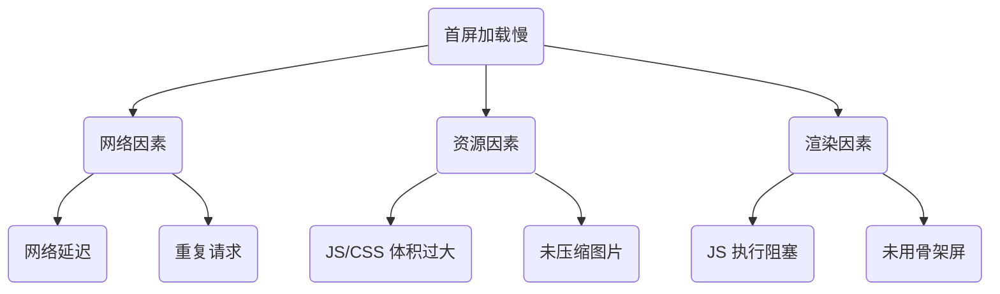

出处：[掘金](https://juejin.cn/post/7526304394233626658)

原作者：前端微白

---

# 首屏为何如此之慢？



用户感知数据：

- 0-1 秒：流畅体验
- 1-3 秒：轻度焦虑
- 3+ 秒：53% 用户会离开

# 资源加载优化（解决网络瓶颈）

## 1. HTTP 强缓存 - CDN 加速利器

```nginx
# Nginx配置（缓存 JS/CSS 30天）
location ~* \.(js|css)$ {
    add_header Cache-Control "public, max-age=2592000";
    # 文件变动自动更新缓存（避免手动刷新）
    if ($request_uri ~* "\?v=\d+") {
        expires max;
    }
}
```

适用场景：Vue/React 框架文件、UI 库等公共资源
效果：二次加载速度提升 80%

## 2. Service Worker - 离线访问黑科技

```js
// sw.js 核心代码
self.addEventListener('install', e => {
    e.waitUntil(
        caches.open('v1').then(cache => 
            // 只缓存关键资源
            cache.addAll([
                '/', 
                '/styles/core.css',
                '/scripts/main.min.js'
            ])
        )
    );
});

self.addEventListener('fetch', e => {
    // 优先从缓存读取，失败再请求网络
    e.respondWith(
        caches.match(e.request).then(res => 
            res || fetch(e.request)
        )
    );
});
```

优势对比：

| 方案             | 离线支持 | 控制粒度 | 更新机制      |
| -------------- | ---- | ---- | --------- |
| HTTP缓存         | ❌    | 粗    | 依赖 Header |
| Service Worker | ✅    | 精细   | 主动更新      |

## 3. 预加载关键资源 - 消除渲染阻塞

```html
<!-- 在 <head> 中优先加载关键 CSS -->
<link rel="preload" href="/styles/core.css" as="style">
<link rel="preload" href="https://unpkg.com/vue@3/dist/vue.global.js" as="script">

<!-- 非关键资源延后 -->
<script src="analytics.js" defer></script>
```

原理：让浏览器优先下载阻塞渲染的资源

# 资源体积压缩（解决传输瓶颈）

## 1. 代码瘦身三招

```js
// vite.config.js 优化配置
export default {
    build: {
        chunkSizeWarningLimit: 500, // 分片阈值
        rollupOptions: {
            output: {
                manualChunks: {
                    // 将 react 全家桶单独打包
                    'react-vendor': ['react', 'react-dom', 'react-router-dom']
                }
            }
        },
        brotliSize: true // 启用 Brotli 压缩
    }
}
```

效果对比：

| 优化前           | 优化手段         | 优化后   |
| ------------- | ------------ | ----- |
| main.js 2.1MB | Tree Shaking | 1.4MB |
| 1.4MB         | Gzip 压缩      | 340KB |
| 340KB         | Brotli 压缩    | 190KB |

##  2. 图片优化实战

```vue
// 自动转换 WebP 格式（vue 组件示例）
<template>
    <picture>
        <source srcset="image.webp" type="image/webp">
        
    </picture>
</template>

<script>
// 检查浏览器支持度
const isWebPSupported = () => 
    document.createElement('canvas').toDataURL('image/webp').includes('image/webp');
    
export default {
    mounted() {
        if (!isWebPSupported()) {
            this.$refs.image.src = 'image.jpg';
        }
    }
}
</script>
```

压缩效果：

- JPG → WebP：体积减少 50-70%
- PNG → WebP：体积减少 30-50%

# 渲染策略优化（解决执行瓶颈）

## 1. 路由懒加载 - 按需加载之王

```jsx
// React 路由配置
const Home = React.lazy(() => import('./Home'));

function App() {
    return (
        <Suspense fallback={<LoadingSpinner />}>
            <Route path="/" exact component={Home} />
        </Suspense>
    );
}

// Vue 等效写法
const routes = [{
    path: '/dashboard',
    component: () => import('./Dashboard.vue')
}];
```

优势：首屏只需加载当前路由资源，减少 50% 初始负载

## 2. 组件级懒加载 - 视口动态加载

```jsx
// 当元素进入视口时加载组件（React 示例）
import { useInView } from 'react-intersection-observer';

const LazyChart = () => {
    const [ref, inView] = useInView({ triggerOnce: true });
    
    return (
        <div ref={ref}>
            {inView ? <HeavyChartComponent /> : <div className="h-64" />}
        </div>
    );
}
```

## 3. 骨架屏技术 - 心理感知优化

```jsx
// 电商商品卡片骨架屏
const ProductSkeleton = () => (
    <div className="skeleton-card">
        <div className="skeleton-img h-48 bg-gray-200" />
        <div className="skeleton-title mt-4 h-6 w-4/5 bg-gray-300" />
        <div className="skeleton-price mt-2 h-4 w-1/4 bg-gray-300" />
    </div>
);
```

用户体验提升：用户感知等待时间减少 40%，即使实际加载时间相同

# 终极方案：服务端渲染（SSR）

##  1. Next.js 实战演示

```jsx
// pages/index.jsx - 服务端获取数据
export async function getServerSideProps() {
    const res = await fetch('https://api.example.com/products');
    const products = await res.json();
    
    return { props: { products } }; 
}

export default function Home({ products }) {
    // 数据直接用于渲染
    return products.map(p => <Product key={p.id} {...p} />)
}
```

SSR VS. CSR 性能对比:

| 指标         | CSR（客户端渲染） | SSR（服务端渲染） |
| ---------- | ---------- | ---------- |
| 首屏时间       | 慢（3-5s）    | 快（0.5-1s）  |
| SEO 支持     | 差          | 优秀         |
| TTI（可交互时间） | 快          | 可能稍慢       |
| 适用场景       | 后台系统       | 内容型网站      |

# 效果验证与持续优化

## 性能监控脚本

```js
// 首屏性能采集（基于 Performance API）
const reportPerf = () => {
    const [{ startTime, duration: fcp }] = 
        performance.getEntriesByName('first-contentful-paint');
    
    window.dataLayer.push({
        event: 'perf_metrics',
        fcp,
        lcp: performance.getEntriesByName('largest-contentful-paint')[0].startTime,
        // 核心指标监控...
    });
};

// 页面加载完成后发送
window.addEventListener('load', reportPerf);
```

## Lighthouse 优化前后对比

|指标|优化前|优化后|提升幅度|
|---|---|---|---|
|First Contentful Paint|4.2s|0.8s|81%|
|Largest Contentful Paint|6.1s|1.2s|80%|
|可交互时间 (TTI)|4.5s|1.0s|78%|
|综合评分|45|92|翻倍|

## 优化策略黄金法则

1. 轻度项目：路由懒加载 + 图片压缩 + 预加载
2. 中型项目：HTTP 强缓存 + Service Worker + 骨架屏
3. 大型内容站：Next.js/Nuxt.js 服务端渲染
4. 混合应用：SSR 首屏 + CSR 内页 + IndexedDB 缓存
