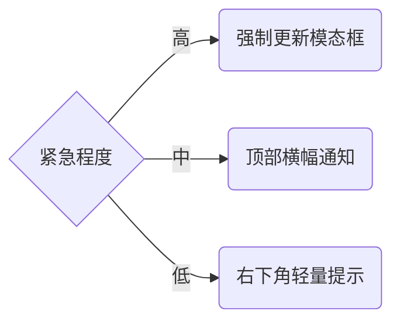

出处：[掘金](https://juejin.cn/post/7523255902439456822)

原作者：前端微白

---

> 前端部署的新挑战：2023 年 Stack Overflow 调查显示，78% 的用户在遇到问题时会忽略手动刷新操作。本文将深入探讨如何在应用发布新版本后，优雅地通知用户刷新页面以获取最新功能

# 为什么需要更新通知？

核心问题：现代 Web 应用的频繁更新与用户长期保持浏览器标签页打开行为之间的矛盾

- 静态资源缓存：浏览器缓存导致用户仍在运行旧版本代码
- 版本不一致问题：前端新功能需要对接后端 API 变更
- 数据兼容性风险：旧版本处理新数据结构可能引发错误
- 用户体验断层：用户无法及时获得功能改进和修复

# 检测更新的技术方案

## 版本比对策略

原理：打包时生成唯一版本号，轮询检查服务端最新版本

前端版本存储在构建时生成的文件中：

```json
// version.json
{
  "version": "2023.07.15.1",
  "buildTime": "2023-07-15T14:30:00Z"
}
```

轮询检测实现：

```js
const CHECK_INTERVAL = 5 * 60 * 1000; // 每 5 分钟检查一次

async function checkUpdate() {
  try {
    const resp = await fetch('/version.json?t=' + Date.now());
    const remoteVersion = await resp.json();
    const localVersion = await fetchVersion(); // 从本地版本文件读取
    
    if (remoteVersion.version !== localVersion.version) {
      showUpdateNotification();
    }
  } catch (error) {
    console.error('版本检查失败', error);
  }
}

// 启动轮询
setInterval(checkUpdate, CHECK_INTERVAL);
// 初始检查
checkUpdate();
```

## WebSocket 实时通知

适用于需要即时更新的场景

```js
// 前端连接 WebSocket
const socket = new WebSocket('wss://api.example.com/updates');

socket.addEventListener('message', event => {
  const data = JSON.parse(event.data);
  if (data.type === 'frontend-update') {
    showImmediateUpdate(data.version);
  }
});
```

# 通知策略与 UI 设计模式

## 通知



## 刷新

### 自动刷新策略（谨慎使用）

```js
let userInactiveTimer;

function scheduleAutoRefresh() {
  // 15 分钟后自动刷新
  userInactiveTimer = setTimeout(() => {
    if (document.visibilityState === 'hidden') {
      // 如果页面在后台，延迟到用户回来
      document.addEventListener('visibilitychange', () => {
        if (document.visibilityState === 'visible') {
          refreshWithCountdown();
        }
      });
      return;
    }
    refreshWithCountdown();
  }, 15 * 60 * 1000); // 15 分钟
}

function refreshWithCountdown() {
  // 显示倒计时 UI
  showCountdownModal(60, () => {
    location.reload(true);
  });
}

function showCountdownModal(seconds, callback) {
  // 实现倒计时 UI 逻辑
  // ...
}
```

### Service Worker 无缝更新

```js
// sw.js
const CACHE_NAME = 'app-cache-v2';
const WAITING_TIMEOUT = 24 * 60 * 60 * 1000; // 24 小时等待期

self.addEventListener('install', event => {
  // 预缓存新资源
  event.waitUntil(
    caches.open(CACHE_NAME).then(cache => {
      return cache.addAll([
        '/',
        '/main.js',
        '/styles.css',
        // ...其他关键资源
      ]);
    })
  );
});

self.addEventListener('activate', event => {
  // 清理旧缓存
  event.waitUntil(
    caches.keys().then(cacheNames => {
      return Promise.all(
        cacheNames
          .filter(name => name !== CACHE_NAME)
          .map(name => caches.delete(name))
      );
    })
  );
  
  // 通知客户端更新就绪
  event.waitUntil(
    self.clients.matchAll().then(clients => {
      clients.forEach(client => {
        client.postMessage({
          type: 'sw-updated',
          version: 'v2'
        });
      });
    })
  );
});
```

前端处理 Service Worker 更新：

```js
if ('serviceWorker' in navigator) {
  navigator.serviceWorker.register('/sw.js').then(reg => {
    reg.addEventListener('updatefound', () => {
      const newWorker = reg.installing;
      newWorker.addEventListener('statechange', () => {
        if (newWorker.state === 'installed') {
          if (navigator.serviceWorker.controller) {
            // 显示更新提示
            showUpdateNotification('新版本已准备就绪，刷新后生效');
          }
        }
      });
    });
  });

  // 监听跳过等待后的刷新提示
  navigator.serviceWorker.addEventListener('controllerchange', () => {
    showRefreshNotification('更新完成，请刷新以使用最新版本');
  });
}
```

# 用户体验优化实践

用户友好设计原则：

- 提供明确的价值主张（新功能展示）
- 允许延迟刷新选项（避免中断工作流）
- 刷新前自动保存用户状态
- 提供刷新后恢复上下文的机制

## 更新内容可视化

给用户列出更新了什么内容

```js
function displayUpdateFeatures(versionData) {
  const featuresHTML = versionData.features.map(f => `
    <div class="feature-card">
      <div class="icon">✨</div>
      <div>
        <h3>${f.title}</h3>
        <p>${f.description}</p>
      </div>
    </div>
  `).join('');
  
  // 在通知或模态框中渲染
}
```

## 更新策略选择算法

```js
// 根据使用情况和更新时间智能选择策略
function determineUpdateStrategy(lastUpdateTime) {
  const now = Date.now();
  const hoursSinceLastRefresh = (now - lastUpdateTime) / (1000 * 60 * 60);
  
  // 基于用户活跃度判断
  if (hoursSinceLastRefresh > 48) {
    // 长期未刷新用户
    return 'force-with-features';
  }
  
  // 根据时间段判断
  const hour = new Date().getHours();
  if (hour > 1 && hour < 5) {
    // 凌晨时段，自动刷新
    return 'auto-refresh';
  }
  
  // 工作日工作时间提示更新
  const day = new Date().getDay();
  if (day >= 1 && day <= 5 && hour >= 9 && hour <= 18) {
    return 'notification-with-delay';
  }
  
  // 默认温和通知
  return 'gentle-notification';
}
```

## 更新失败的回滚机制

```js
// 版本健康检查
async function verifyUpdate(duration = 5000) {
  const start = Date.now();
  
  // 检查关键功能是否可用
  const healthChecks = [
    testApiConnection(),
    validateUserDataSchema(),
    testCoreFunctionality()
  ];
  
  try {
    await Promise.race([
      Promise.all(healthChecks),
      new Promise((_, reject) => setTimeout(
        () => reject(new Error('健康检查超时')), 
        duration
      ))
    ]);
  } catch (error) {
    console.error('更新后健康检查失败', error);
    // 触发回滚流程
    rollbackUpdate();
  }
}

function rollbackUpdate() {
  // 清除问题版本缓存
  caches.delete('app-cache-v2');
  
  // 显示错误消息
  showErrorModal('更新遇到问题，已回退到稳定版本');
  
  // 强制刷新以使用旧版本
  location.reload(true);
}
```
