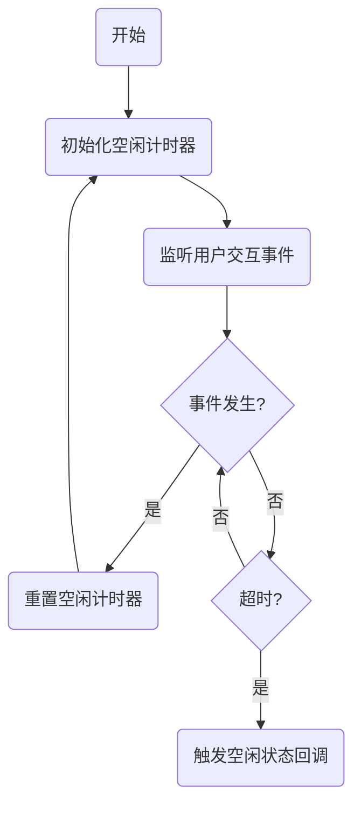

出处：[掘金](https://juejin.cn/post/7524164481833680937)

原作者：前端微白

---

## 什么是用户无操作？

指用户在特定时间内未进行任何操作（如鼠标移动、键盘输入、点击等）。该技术在众多场景中有广泛应用：

- 安全系统：用户长时间无操作自动退出登录
- 媒体应用：暂停播放视频或音乐节省资源
- 数据保护：敏感信息自动隐藏
- 分析工具：用户活跃度统计
- 节能模式：页面切换至低功耗显示

# 实现原理：事件监听与定时器管理

核心是通过监听用户行为事件并重置计时器来实现：



## 基础实现方案

```js
class IdleDetector {
  constructor(timeout = 300000, onIdle = () => {}) {
    this.timeout = timeout; // 默认 5 分钟
    this.onIdle = onIdle; // 空闲状态回调函数
    this.timer = null; // 定时器实例
    this.events = ['mousemove', 'keydown', 'mousedown', 'touchstart', 'scroll'];
    
    // 绑定 this 上下文
    this.resetTimer = this.resetTimer.bind(this);
    this.start = this.start.bind(this);
    this.stop = this.stop.bind(this);
  }
  
  // 重置空闲定时器
  resetTimer() {
    if (this.timer) clearTimeout(this.timer);
    this.timer = setTimeout(() => {
      this.onIdle();
    }, this.timeout);
  }
  
  // 开始检测
  start() {
    // 初始启动定时器
    this.resetTimer();
    
    // 添加事件监听
    this.events.forEach(event => {
      document.addEventListener(event, this.resetTimer);
    });
  }
  
  // 停止检测
  stop() {
    if (this.timer) clearTimeout(this.timer);
    this.events.forEach(event => {
      document.removeEventListener(event, this.resetTimer);
    });
  }
}
```

使用示例：

```js
const detector = new IdleDetector(60000, () => {
  console.log('用户已空闲超过60秒');
  // 执行安全退出或暂停操作
});

// 开始检测
detector.start();

// 当需要停止检测时
// detector.stop();
```

## 页面可见性优化

当用户切换标签页或最小化浏览器时，应调整监测逻辑：

```js
class AdvancedIdleDetector extends IdleDetector {
  constructor(timeout, onIdle) {
    super(timeout, onIdle);
    this.handleVisibilityChange = this.handleVisibilityChange.bind(this);
  }
  
  // 页面可见性变更处理
  handleVisibilityChange() {
    if (document.visibilityState === 'hidden') {
      // 页面不可见时暂停检测
      this.stop();
    } else {
      // 页面恢复可见时重新开始检测
      this.resetTimer();
    }
  }
  
  start() {
    super.start();
    // 添加页面可见性监听
    document.addEventListener('visibilitychange', this.handleVisibilityChange);
  }
  
  stop() {
    super.stop();
    document.removeEventListener('visibilitychange', this.handleVisibilityChange);
  }
}
```

## 多层级回调系统

实现不同级别的空闲提醒：

```js
class MultiLevelIdleDetector extends IdleDetector {
  constructor(timeout, callbacks = {}) {
    super(timeout, callbacks.onIdle || (() => {}));
    this.callbacks = callbacks;
    this.warningLevels = [];
    
    // 初始化警告级别计时器
    if (callbacks.onWarning) {
      // 设置警告级别（如主空闲时间前 30 秒）
      this.warningLevels.push({
        time: timeout - 30000,
        callback: callbacks.onWarning
      });
    }
    
    this.activeTimers = [];
  }
  
  resetTimer() {
    super.resetTimer();
    
    // 清除所有警告计时器
    this.activeTimers.forEach(timer => clearTimeout(timer));
    this.activeTimers = [];
    
    // 设置新的警告计时器
    this.warningLevels.forEach(level => {
      this.activeTimers.push(setTimeout(
        level.callback, 
        level.time
      ));
    });
  }
}
```

## 性能优化与节流技术

避免事件触发过于频繁导致的性能问题：

```js
class OptimizedIdleDetector extends IdleDetector {
  constructor(timeout, onIdle) {
    super(timeout, onIdle);
    this.lastEventTime = 0;
    this.throttleInterval = 1000; // 1 秒节流
  }
  
  // 节流版本的事件处理器
  handleEvent = throttle(() => {
    this.resetTimer();
  }, this.throttleInterval);
  
  start() {
    // 使用节流处理的事件监听
    this.events.forEach(event => {
      document.addEventListener(event, this.handleEvent);
    });
    this.resetTimer();
  }
}

// 节流函数实现
function throttle(fn, interval) {
  let lastCall = 0;
  return function(...args) {
    const now = Date.now();
    if (now - lastCall >= interval) {
      lastCall = now;
      return fn.apply(this, args);
    }
  };
}
```

# 实际应用场景

## 安全登出系统

```js
const logoutDetector = new AdvancedIdleDetector(300000, () => {
  // 显示倒计时弹窗
  showModal(
    '安全提醒', 
    '您即将因长时间无操作被登出',
    { onConfirm: logout }
  );
});

function showModal(title, message, options) {
  // 创建模态框逻辑
  const modal = document.createElement('div');
  modal.innerHTML = `
    <div class="modal-content">
      <h3>${title}</h3>
      <p>${message}</p>
      <div class="countdown">60秒</div>
      <button id="stayLoggedIn">保持登录</button>
    </div>
  `;
  
  // 添加按钮事件
  modal.querySelector('#stayLoggedIn').addEventListener('click', () => {
    logoutDetector.resetTimer();
    document.body.removeChild(modal);
  });
  
  document.body.appendChild(modal);
  
  // 倒计时功能
  let seconds = 60;
  const countdownEl = modal.querySelector('.countdown');
  const countdownTimer = setInterval(() => {
    seconds--;
    countdownEl.textContent = `${seconds}秒`;
    if (seconds <= 0) {
      clearInterval(countdownTimer);
      options.onConfirm();
    }
  }, 1000);
}

function logout() {
  // 登出逻辑
  console.log("用户已从系统登出");
}
```

## 媒体播放控制

```js
class MediaPlayer {
  constructor(videoElement) {
    this.video = videoElement;
    this.idleDetector = new OptimizedIdleDetector(120000, () => {
      this.pause();
      this.showPlayIcon();
    });
    
    this.video.addEventListener('play', () => {
      this.idleDetector.start();
    });
    
    this.video.addEventListener('pause', () => {
      this.idleDetector.stop();
    });
  }
  
  showPlayIcon() {
    const playIcon = document.createElement('div');
    playIcon.className = 'play-overlay';
    playIcon.innerHTML = '▶';
    playIcon.addEventListener('click', () => {
      this.play();
      playIcon.remove();
    });
    this.video.parentElement.appendChild(playIcon);
  }
  
  play() {
    this.video.play();
  }
  
  pause() {
    this.video.pause();
  }
}
```

# 性能优化与最佳实践

```js
// 事件委托优化：在根元素上监听事件，避免多个监听器
document.documentElement.addEventListener('mousemove', handleEvent);
```

```js
// 根据需求选择必要事件，避免过度监听
const essentialEvents = ['keydown', 'mousedown'];
```

```js
// 页面加载优化：延迟初始化避免阻塞页面加载
window.addEventListener('load', () => {
  const detector = new IdleDetector();
  detector.start();
});
```

```js
// 根据不同场景定义不同空闲行为
const config = {
  dashboard: {
    timeout: 300000,
    callback: logout
  },
  videoPlayer: {
    timeout: 60000,
    callback: pauseVideo
  }
};
```

# 注意事项

1. 用户体验优先：空闲处理不应该干扰用户操作
2. 隐私保护：避免检测涉及隐私的行为
3. 性能平衡：事件监听需考虑性能影响
4. 可访问性设计：确保不干扰辅助工具使用
5. 弹性设计：提供配置选项供不同场景使用
