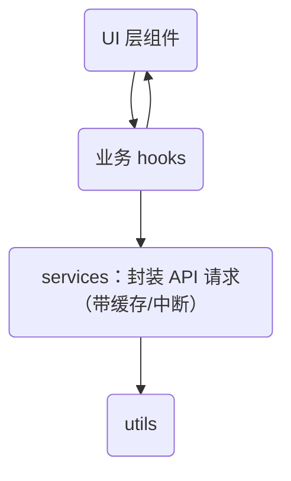

出处：[掘金](https://juejin.cn/post/7524712962072494095)

原作者：金泽宸

---

> 前端的可维护性，来自你是否让每段逻辑“各司其职”

# 写在前面

项目初期，大家常把所有通用逻辑都丢进 `utils`，久而久之：

```text
utils/
├── index.ts
├── tool.ts
├── data.ts
├── format.ts
```

最后没人知道：

- 哪些是通用工具，哪些是业务相关
- 哪些方法有副作用，是否依赖 store、router？
- 哪些函数可以在 SSR 使用？哪些只能前端用？

这篇文章将彻底梳理 utils、hooks、services、store、components 之间的==职责分离标准==，并通过实战示例逐步重构你的项目结构

# 前端模块职责五层结构

| 层级    | 模块                    | 职责          | 依赖关系                   |
| ----- | --------------------- | ----------- | ---------------------- |
| 第 1 层 | `shared/utils/`       | 无状态纯函数，通用逻辑 | 不依赖任何模块                |
| 第 2 层 | `shared/services/`    | 请求封装、接口通用操作 | 可依赖 utils              |
| 第 3 层 | `shared/hooks/`       | 状态逻辑、组合逻辑   | 可依赖 service            |
| 第 4 层 | `modules/**/store.ts` | 状态持久、数据共享   | 可依赖 hook               |
| 第 5 层 | `components/`         | UI 展示、逻辑隔离  | 可调用 hook、store、service |

用一张图表示结构：



# utils 层：只做纯函数

```ts
// shared/utils/date.ts
export function formatDate(date: string | number, format = 'YYYY-MM-DD') {
  return dayjs(date).format(format)
}
```

规范：

- 不引用 Vue 相关内容
- 无副作用
- 可用于 Node 环境、单测、SSR

# services 层：请求封装、状态透明

```ts
// shared/services/userService.ts
import { request } from '@/shared/utils/request'

export const getUserInfo = () => request.get('/api/user/info')
export const updateUserName = (name: string) =>
  request.post('/api/user/update', { name })
```

封装 `request`：

```ts
// shared/utils/request.ts
export const request = {
  get: (url: string, config?: any) => axios.get(url, config),
  post: (url: string, data?: any) => axios.post(url, data),
}
```

这样做的好处：

- `request` 层统一处理 token、错误提示、loading
- `service` 层专注 API 参数定义

# hooks 层：处理副作用 + 状态组合

示例：封装一个 `useUserInfo` Hook

```ts
// shared/hooks/useUserInfo.ts
import { ref, onMounted } from 'vue'
import { getUserInfo } from '@/shared/services/userService'

export function useUserInfo() {
  const userInfo = ref(null)
  const loading = ref(false)

  async function fetch() {
    loading.value = true
    userInfo.value = await getUserInfo()
    loading.value = false
  }

  onMounted(fetch)

  return { userInfo, loading, refresh: fetch }
}
```

使用方式：

```vue
<script setup>
const { userInfo, loading } = useUserInfo()
</script>
```

# store 层：全局状态/数据同步场景

如果某个数据被多个模块共享，如“用户信息”、“系统主题”、“权限列表”等，可以放入 store：

```ts
// store/userStore.ts
import { defineStore } from 'pinia'

export const useUserStore = defineStore('user', {
  state: () => ({
    info: null,
  }),
  actions: {
    async fetch() {
      this.info = await getUserInfo()
    },
  },
})
```

```vue
<script setup>
const userStore = useUserStore()
onMounted(() => userStore.fetch())
</script>
```

好处：

- 状态统一存储
- 支持 SSR、数据持久化
- 可跨模块访问

# 组件职责设计标准

| 类型   | 放置目录                | 举例                 | 是否与 UI 耦合 |
| ---- | ------------------- | ------------------ | --------- |
| 页面组件 | `modules/xxx/views` | `UserProfile.vue`  | ✅         |
| 通用组件 | `shared/components` | `Dialog.vue`       | ✅         |
| 函数逻辑 | `shared/hooks`      | `usePagination.ts` | ❌         |
| 数据操作 | `services`          | `userService.ts`   | ❌         |
| 工具方法 | `utils`             | `formatDate.ts`    | ❌         |

# 项目目录复盘前后对比

|❌ 原始结构|✅ 解耦后结构|
|---|---|
|所有逻辑混在组件里|数据 → hooks → service → utils|
|API 请求直接写页面里|请求封装统一处理 loading / 错误|
|utils 混乱、重复|纯函数清晰拆分、无副作用|
|store 滥用|只用于真正全局共享的状态|
