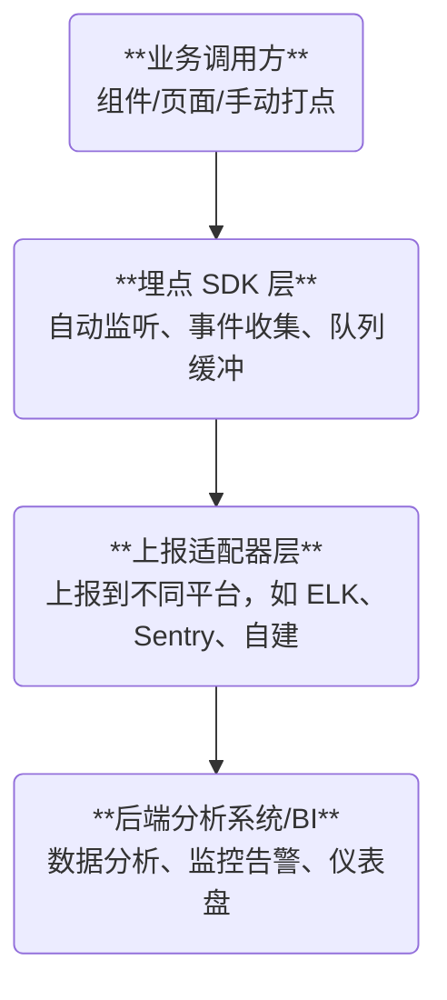

出处：[掘金](https://juejin.cn/post/7525011881045409826)

原作者：金泽宸

---

> 埋点系统是产品与用户之间的“数据翻译器”，架构师必须让“数据可观测、可分析、可依赖”

# 写在前面

在成熟的前端系统中，==埋点系统是数据驱动业务优化的基础设施==。 你必须能回答这些问题：

- 用户是如何使用你设计的功能的？
- 页面是否有异常？在哪个版本上？
- 哪些按钮常点？哪些页面访问量低？
- 哪些用户路径有“跳出率”问题？

这篇文章将从实战角度，帮你构建一套通用、高可控、低侵入的前端埋点系统，支持以下能力：

- 页面级自动曝光
- 手动事件打点
- 上报节流 + 批处理
- 版本、设备、用户环境携带
- 插件式接入（支持多个平台）

# 埋点系统的分层架构



# 目标能力设计

| 能力   | 实现方式                                             |
| ---- | ------------------------------------------------ |
| 自动上报 | 页面曝光、点击、浏览等                                      |
| 手动埋点 | `trackEvent({ type, label, payload })`           |
| 公共参数 | `userId`、`platform`、`device`、`browser`、`version` |
| 异常采集 | 全局监听 + 上报                                        |
| 上报策略 | 节流 + 批量合并 + 空闲发送                                 |
| 插件机制 | 支持自定义上报（如 GA、埋点平台）                               |

# 核心 SDK 实现

> 更详细的文章：[[007.前端监控|前端监控]]

## 基础打点函数（无侵入）

```ts
// sdk/track.ts
export function trackEvent(event: {
  type: string
  label?: string
  payload?: Record<string, any>
}) {
  const baseInfo = {
    time: Date.now(),
    userId: getUserId(),
    url: location.href,
    device: getDevice(),
    version: __APP_VERSION__,
  }

  const eventData = { ...baseInfo, ...event }
  queue.push(eventData)
  scheduleUpload()
}
```

##  页面自动曝光（路由监听）

```ts
// sdk/autoPage.ts
import { router } from '@/router'
router.afterEach((to) => {
  trackEvent({ type: 'page_view', label: to.fullPath })
})
```

## DOM 点击埋点

```ts
// sdk/domTracker.ts
document.body.addEventListener('click', (e) => {
  const el = e.target as HTMLElement
  const label = el.getAttribute('data-track')
  if (label) {
    trackEvent({ type: 'click', label })
  }
})
```

使用方式：

```html
<button data-track="首页-立即购买">立即购买</button>
```

## 异常捕获上报

```ts
// sdk/exception.ts
window.onerror = (msg, src, line, col, error) => {
  trackEvent({
    type: 'error',
    label: msg.toString(),
    payload: {
      src, line, col,
      stack: error?.stack,
    },
  })
}
```

# 上报优化策略（节流、批量）

```ts
let queue: any[] = []
let timer: any = null

function scheduleUpload() {
  if (timer) return

  timer = setTimeout(() => {
    const payload = [...queue]
    queue = []
    timer = null
    send(payload)
  }, 3000)
}

function send(data: any[]) {
  navigator.sendBeacon('/api/track', JSON.stringify(data))
}
```

# 插件机制支持（上报适配器）

```ts
// sdk/plugins.ts
const plugins: Array<(data: any) => void> = []

export function registerPlugin(fn: (data: any) => void) {
  plugins.push(fn)
}

function send(data: any[]) {
  plugins.forEach((fn) => fn(data))
}
```

注册适配器：

```ts
registerPlugin((data) => {
  fetch('/api/track', {
    method: 'POST',
    body: JSON.stringify(data),
  })
})

registerPlugin((data) => {
  if (window.gtag) {
    window.gtag('event', data.type, { label: data.label })
  }
})
```

# 数据后端结构建议

埋点接口结构：

```json
{
  "type": "click",
  "label": "首页-立即购买",
  "time": 171234567890,
  "userId": "u1023",
  "url": "https://xxx.com/home",
  "device": "iPhone Safari",
  "payload": { "sku": "123", "price": "99" }
}
```

推荐存储方案：

|存储平台|推荐原因|
|---|---|
|ELK（ElasticSearch + Kibana）|实时可视化，支持搜索分析|
|ClickHouse + BI 工具|海量日志分析，高吞吐|
|自建 Mongo + Dashboard|成本低，易部署|

# 埋点设计常见误区

|错误|正确方式|
|---|---|
|所有事件都写死在组件中|封装通用 SDK，解耦页面与埋点|
|每次点击都立即上传|批量合并 + sendBeacon 异步|
|不加公共参数|统一参数注入（版本、用户、设备）|
|缺乏后端字段规范|提前定义字段 schema + 版本控制|

# 适配多平台埋点

方案建议：

|平台|接入方式|
|---|---|
|Web|DOM + 路由监听|
|H5|使用 data-track 或 Vue 指令封装|
|微信小程序|替换为 wx.track + storage|
|Electron|打包内嵌上报 SDK，使用 fetch/sendBeacon|
|Unity/WebGL|提供 JS Bridge，上报数据至 SDK|

# 推荐封装结构

```text
sdk/
├── index.ts              # 对外 track 接口
├── autoPage.ts           # 页面曝光
├── domTracker.ts         # DOM 点击
├── exception.ts          # 异常捕获
├── plugins.ts            # 上报适配器机制
├── queue.ts              # 批量发送控制器
└── utils.ts              # 获取版本、设备、用户
```

业务中统一调用：

```ts
trackEvent({ type: 'click', label: '商品-收藏' })
```
