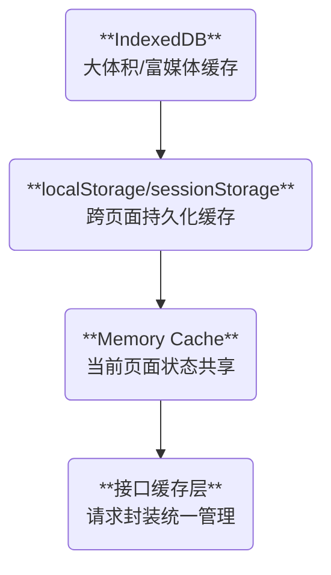

出处：[掘金](https://juejin.cn/post/7526599654713786383)

原作者：金泽宸

---

> 缓存不是“为了省请求”，而是“为了体验稳定、数据安全、系统弹性”

# 写在前面

缓存设计的好坏，直接决定前端系统的性能上限与用户体验下限

一个优秀的架构师需要理解并合理运用以下缓存层：

| 层级                          | 作用               | 生命周期      |
| --------------------------- | ---------------- | --------- |
| Memory 缓存                   | 页面内高频数据复用        | 页面生命周期    |
| localStorage/sessionStorage | 跨页面共享、快速读取       | 永久 / 会话   |
| IndexedDB                   | 大体积、结构化数据        | 长期        |
| 接口缓存层                       | 减少请求压力、接口回源      | 配置化 / TTL |
| HTTP 缓存                     | CDN/browser 缓存响应 | 浏览器策略控制   |

本篇将系统梳理前端所有可用缓存策略，并结合实战封装一个统一的缓存工具库与请求缓存机制

# 缓存分层模型图



# 封装一个统一的缓存工具库

```ts
// cache/index.ts
export const cache = {
  memory: new Map<string, any>(),

  setLocal(key: string, value: any) {
    localStorage.setItem(key, JSON.stringify(value))
  },

  getLocal<T>(key: string): T | null {
    const raw = localStorage.getItem(key)
    try {
      return raw ? JSON.parse(raw) : null
    } catch {
      return null
    }
  },

  setSession(key: string, value: any) {
    sessionStorage.setItem(key, JSON.stringify(value))
  },

  getSession<T>(key: string): T | null {
    const raw = sessionStorage.getItem(key)
    try {
      return raw ? JSON.parse(raw) : null
    } catch {
      return null
    }
  },

  clear(key?: string) {
    if (key) {
      localStorage.removeItem(key)
      sessionStorage.removeItem(key)
      this.memory.delete(key)
    } else {
      localStorage.clear()
      sessionStorage.clear()
      this.memory.clear()
    }
  },
}
```

# 接口缓存封装（支持 TTL）

```ts
// cache/requestCache.ts
const requestCache = new Map<string, { data: any; expire: number }>()

export async function cachedRequest<T>(
  key: string,
  requestFn: () => Promise<T>,
  ttl = 5000
): Promise<T> {
  const now = Date.now()
  const cacheItem = requestCache.get(key)

  if (cacheItem && now < cacheItem.expire) {
    return cacheItem.data
  }

  const data = await requestFn()
  requestCache.set(key, { data, expire: now + ttl })
  return data
}
```

使用方式：

```ts
const userInfo = await cachedRequest('userInfo', getUserInfo, 30000)
```

# 应用场景实战示例

场景 1：分页接口“翻页返回”不重复请求

```ts
const cacheKey = `goods?page=${page}&size=${size}`
const goodsList = await cachedRequest(cacheKey, () => getGoodsList({ page, size }), 60000)
```

场景 2：配置类接口（如“角色列表”、“系统配置”）

```ts
const roles = await cachedRequest('static_roles', fetchRoles, 5 * 60 * 1000)
```

场景 3：首页推荐数据缓存（Memory + Fallback to Storage）

```ts
const key = 'homepageRecommend'
let data = cache.memory.get(key) || cache.getLocal(key)

if (!data) {
  data = await fetchHomepage()
  cache.memory.set(key, data)
  cache.setLocal(key, data)
}
```

# 缓存安全与有效性策略

|问题|建议方案|
|---|---|
|多用户切换缓存污染|缓存 key 添加 userId 前缀|
|数据更新后缓存未同步|在接口响应中返回 version/hash 与本地对比|
|过期缓存未清除|TTL 控制 + 定期清理任务|
|本地缓存中数据结构变动|版本标识 + 缓存结构迁移方案|

# 缓存与离线能力结合

可以扩展支持 PWA/Service Worker 缓存：

```js
// sw.js
self.addEventListener('fetch', (event) => {
  if (event.request.method !== 'GET') return

  event.respondWith(
    caches.match(event.request).then((cachedRes) => {
      return cachedRes || fetch(event.request).then((res) => {
        const resClone = res.clone()
        caches.open('my-cache').then((cache) => cache.put(event.request, resClone))
        return res
      })
    })
  )
})
```

# 缓存监控与调试建议

- Chrome DevTools → Application 面板查看 localStorage、sessionStorage、IndexedDB
- 添加缓存命中/写入 log（用于调试性能）：`console.log('[CACHE] HIT: ' + key)`
- 后端响应中返回 `X-Cache-Status: HIT/MISS`
- 开发环境中提供“清除缓存”按钮/快捷键
