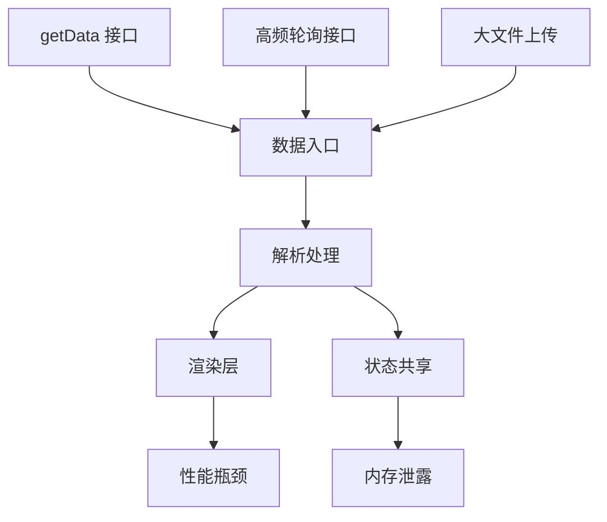

出处：[掘金](https://juejin.cn/post/7526961337819283494)

原作者：金泽宸

---

> 在高并发和大数据面前，架构师要做的不是“抗住压力”，而是主动降本增效，精细化分层优化

# 写在前面

随着业务发展，前端系统经常面临这样的问题：

- 一页展示数万条数据，DOM 卡顿严重
- 高频轮询、并发请求导致接口排队、响应抖动
- 数据量一大就加载慢、交互迟缓
- 一个页面开着十分钟内存飙升到几百 MB

这些问题的根源在于前端没有针对大数据量 + 高并发场景进行系统性的架构设计

本篇将给出一整套从数据入口到渲染出口的系统优化方案，并配合代码实现

# 大数据 + 高并发系统瓶颈分析图



# 高并发请求优化策略

## 请求合并（Batching）

将多个小请求合并为一个：

```ts
// before：每次输入触发请求
watch(searchInput, async (val) => {
  const res = await fetch(`/api/search?q=${val}`)
})

// after：500ms 内只请求一次
import debounce from 'lodash.debounce'

watch(searchInput, debounce(async (val) => {
  const res = await fetch(`/api/search?q=${val}`)
}, 500))
```

## 并发控制（Concurrency Limit）

[[020.手写系列：promise 限制最大并发|promise 限制最大并发]]

## 接口缓存 + 去重

```ts
const inflightMap = new Map()

async function fetchOnce(key: string, fn: () => Promise<any>) {
  if (inflightMap.has(key)) return inflightMap.get(key)

  const promise = fn()
  inflightMap.set(key, promise)
  const result = await promise
  inflightMap.delete(key)
  return result
}
```

# 大数据量渲染优化策略

## 分片渲染 + 虚拟滚动（Virtual Scroll）

核心思想：只渲染可视区域内的内容，节省 DOM 数量

[[003.高性能渲染十万条数据|高性能渲染十万条数据]]

## 分页 + 滚动加载（infinite-scroll）

```ts
async function loadMore() {
  if (loading || noMore) return
  loading = true

  const data = await getData({ page: pageNo++ })
  list.push(...data)
  loading = false

  if (data.length < pageSize) noMore = true
}
```

搭配 `IntersectionObserver` 触底触发：

```ts
const observer = new IntersectionObserver(([entry]) => {
  if (entry.isIntersecting) loadMore()
})
observer.observe(loadingRef.value)
```

# 数据预处理优化策略

## Web Worker 做数据预处理（避免主线程阻塞）

```ts
// worker.ts
self.onmessage = (e) => {
  const data = heavyParse(e.data)
  self.postMessage(data)
}
```

主线程调用：

```ts
const worker = new Worker('./worker.ts')
worker.postMessage(rawData)
worker.onmessage = (e) => {
  const parsedData = e.data
}
```

## 分片加载（Chunk Load）

将大数据分页打包：

```ts
const chunkSize = 1000
function splitChunks(arr: any[], size: number) {
  const res = []
  for (let i = 0; i < arr.length; i += size) {
    res.push(arr.slice(i, i + size))
  }
  return res
}
```

# 内存泄漏与资源回收

内存泄漏场景：

- 未清理的定时器 / 事件监听
- 全局变量引用未释放
- 大量 DOM 节点未解绑
- WebSocket 长连接未 close

正确清理：

```ts
onUnmounted(() => {
  clearInterval(timer)
  socket.close()
  observer.disconnect()
})
```

推荐配合 Chrome DevTools：

- Memory snapshot 查看 DOM Retainers
- Timeline → Heap usage 追踪内存泄漏位置

# 性能监控建议

| 指标      | 工具                             | 说明                  |
| ------- | ------------------------------ | ------------------- |
| 首屏加载时间  | Performance API                | `performance.now()` |
| 慢请求接口   | Axios Interceptor              | > 1000ms 上报         |
| DOM 节点数 | MutationObserver               | 超过 3000 警告          |
| 内存占用    | `performance.memory`           | 超过阈值上报              |
| 卡顿检测    | `requestIdleCallback` / FPS 统计 | <30 fps 预警          |

# 前端架构优化建议清单

|场景|最佳实践|
|---|---|
|页面大表格卡顿|虚拟滚动 + 分段渲染|
|高频刷新接口|缓存 + 去重 + 合并|
|表单多联动|Debounce + 节流触发|
|WebSocket 连接过多|心跳检测 + reconnect 策略|
|长页面滚动卡顿|图片懒加载 + IntersectionObserver|
|报表图表卡顿|使用 Canvas / WebGL 渲染|
|上线前评估性能|Lighthouse + PageSpeed Insights 自动化分析|
