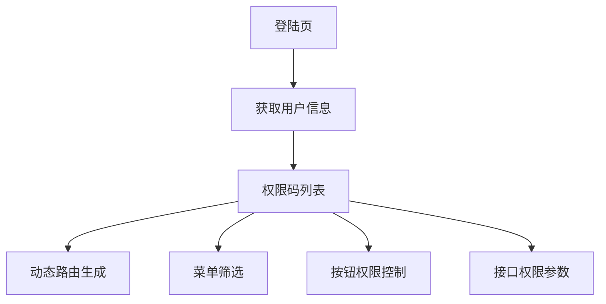

出处：[掘金](https://juejin.cn/post/7527203646141612032)

原作者：金泽宸

---

> 优秀的权限系统应当做到灵活拆分、全局统一、颗粒精细、后端驱动、前端接入轻量化

# 写在前面

权限系统是前端架构中极易被忽略又极其重要的模块。它决定了：

- 页面级访问控制是否安全
- 不同用户是否看到“自己该看的”按钮、菜单、模块
- 灰度发布是否精准可控

不管你是 ToB 管理系统，还是大型 C 端应用，权限设计都必须“前后联动 + 动态精准”

# 前端权限分类总览

|权限类型|示例|场景|
|---|---|---|
|路由权限|`/admin`, `/finance`|控制页面访问入口|
|菜单权限|左侧导航栏|决定展示哪些模块入口|
|按钮权限|“删除”、“导出”、“设置”等按钮|控制具体操作行为|
|数据权限|只能看到自己/自己部门的数据|细粒度数据级隔离|
|灰度权限|A 看到新功能，B 看不到|实验 / 版本控制|

整体架构设计图（权限控制流）：



# 后端返回权限数据结构设计

推荐结构：

```json
{
  "user": {
    "id": 1001,
    "role": "admin",
    "permissions": [
      "page.user.list",
      "page.user.edit",
      "btn.user.create",
      "btn.user.export",
      "menu.finance",
      "gray.newFeature"
    ]
  }
}
```

- 使用 `"type.target"` 命名规则，方便分类处理
- 统一处理“角色”和“权限码”组合验证

# 路由权限控制

示例路由配置：

```js
const routes = [
  {
    path: '/user',
    name: 'UserList',
    component: () => import('@/pages/UserList.vue'),
    meta: { permission: 'page.user.list' }
  },
  {
    path: '/finance',
    name: 'Finance',
    component: () => import('@/pages/Finance.vue'),
    meta: { permission: 'page.finance.view' }
  }
]
```

路由拦截逻辑：

```js
router.beforeEach((to, from, next) => {
  const required = to.meta.permission
  if (required && !userPermissions.includes(required)) {
    return next('/403')
  }
  next()
})
```

# 菜单权限控制

```js
function filterMenus(menus, permissions) {
  return menus.filter(menu => {
    if (!menu.permission || permissions.includes(menu.permission)) {
      if (menu.children) {
        menu.children = filterMenus(menu.children, permissions)
      }
      return true
    }
    return false
  })
}
```

示例菜单结构：

```js
[
  { label: '用户管理', path: '/user', permission: 'menu.user' },
  { label: '财务中心', path: '/finance', permission: 'menu.finance' }
]
```

# 按钮权限封装

v-permission 指令：

```js
// v-permission.js
export default {
  mounted(el, binding) {
    const has = userPermissions.includes(binding.value)
    if (!has) el.parentNode?.removeChild(el)
  }
}
```

使用：

```vue
<Button v-permission="'btn.user.create'">新增用户</Button>
<Button v-permission="'btn.user.export'">导出数据</Button>
```

可做成组件级别控制：

```vue
<PermissionButton permission="btn.user.create">新增</PermissionButton>
```

# 数据权限处理

后台返回：

```json
"dataScope": {
  "type": "department", // self / department / all
  "departmentIds": [101, 102]
}
```

前端接口统一注入：

```js
axios.interceptors.request.use(config => {
  config.headers['x-data-scope'] = JSON.stringify(userDataScope)
  return config
})
```

后端根据 headers 控制数据行级查询

# 灰度发布控制策略

权限码控制灰度功能开关：

```js
if (userPermissions.includes('gray.newFeature')) {
  showNewModule = true
}
```

也可配合 A/B 实验平台：

- 设置灰度标识字段 `user.flags = ['exp_new_user_center']`
- 判断是否渲染新组件

# 典型权限逻辑组合案例

|场景|控制方式|
|---|---|
|A 用户能进页面但看不到“删除按钮”|页面级权限 ✅，按钮权限 ❌|
|B 用户能看到菜单但点击跳转被 403|菜单权限 ✅，路由权限 ❌|
|C 用户不能导出所有用户，仅能导出本部门|页面 + 数据权限|
|D 用户能体验新 UI 但不能访问新 API|灰度标记 ✅，接口权限 ❌|
