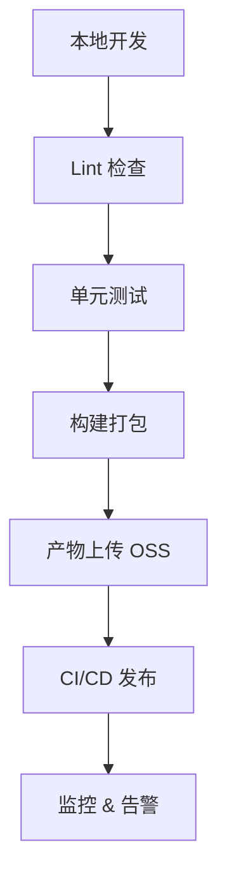

出处：[掘金](https://juejin.cn/post/7527247782533480482)

原作者：金泽宸

---

> 真正优秀的前端架构师，不仅要会“写代码”，还要会“写好团队的工具链与交付系统”

# 写在前面

架构师的职责不仅仅是写好业务代码，更重要的是提升整个团队的交付效率和质量保障能力

而工程化系统，就是团队交付体系的“发动机”：

- 如何构建极速、稳定？
- 如何自动化部署、版本标记？
- 如何引入 Lint、Test、打包分析、监控？

从实战出发，全面构建一个现代化前端工程体系

# 现代工程化系统架构图



# 构建系统优化（Vite + ESBuild）

推荐方案：

|模块|选择|
|---|---|
|构建工具|Vite + ESBuild|
|编译语言|TypeScript|
|样式方案|CSS Modules / TailwindCSS|
|包分析|`rollup-plugin-visualizer`|
|构建缓存|`turbo` / `esbuild cache`|
|多包项目|`pnpm workspaces`|

示例 `vite.config.ts`：

```ts
import { defineConfig } from 'vite'
import vue from '@vitejs/plugin-vue'
import visualizer from 'rollup-plugin-visualizer'

export default defineConfig({
  plugins: [vue(), visualizer()],
  build: {
    outDir: 'dist',
    sourcemap: true,
  }
})
```

# 代码质量体系（Lint + Prettier + Husky）

配置 `.eslintrc.js` 示例：

```js
module.exports = {
  extends: ['eslint:recommended', 'plugin:vue/vue3-recommended', 'prettier'],
  rules: {
    'vue/no-v-html': 'off',
    'no-console': 'warn'
  }
}
```

Prettier：

```json
// .prettierrc
{
  "semi": false,
  "singleQuote": true,
  "printWidth": 100
}
```

Git Hooks 自动检查（husky + lint-staged）：

```shell
# 安装
pnpm add -D husky lint-staged
npx husky install
npx husky add .husky/pre-commit "npx lint-staged"
```

```json
// package.json
"lint-staged": {
  "*.{js,ts,vue}": ["eslint --fix", "prettier --write"]
}
```

# 测试体系接入（Jest + Vue Test Utils）

```ts
// user.spec.ts
import { shallowMount } from '@vue/test-utils'
import User from '../User.vue'

describe('User.vue', () => {
  it('should render name prop', () => {
    const wrapper = shallowMount(User, {
      props: { name: 'Tom' }
    })
    expect(wrapper.text()).toContain('Tom')
  })
})
```

重点测试公共组件、核心逻辑、工具函数等

# 版本管理与构建产物发布

changesets 自动生成 changelog + 版本：

```shell
pnpm changeset
pnpm changeset version
pnpm changeset publish
```

结合 GitHub Action 可实现：

- 自动生成变更日志
- 自动打 Tag 发布版本
- 自动部署产物（OSS/CDN）

# CI/CD 发布流程设计（GitHub Actions + Vercel）

GitHub Actions 示例 `.github/workflows/deploy.yml`：

```yaml
name: Deploy

on:
  push:
    branches:
      - main

jobs:
  build-and-deploy:
    runs-on: ubuntu-latest
    steps:
      - uses: actions/checkout@v3
      - uses: pnpm/action-setup@v2
        with:
          version: 8
      - run: pnpm install
      - run: pnpm build
      - run: aws s3 sync dist/ s3://your-bucket --delete
```

可根据环境（prod/stage/dev）进行构建参数控制

# 前端性能监控与告警（Sentry + Web-Vitals）

接入 Web Vitals：

```js
import { getCLS, getFID, getLCP } from 'web-vitals'

getCLS(console.log)
getFID(console.log)
getLCP(console.log)
```

接入 Sentry：

```js
Sentry.init({
  dsn: 'https://examplePublicKey@o0.ingest.sentry.io/0',
  integrations: [new Sentry.BrowserTracing()],
})
```

实时监控错误率、卡顿点、慢加载等问题

# 工程优化建议清单

|维度|建议|
|---|---|
|构建|使用 Vite + esbuild 替换 webpack|
|性能|启用 gzip + brotli，懒加载路由|
|监控|接入 Sentry + Web Vitals|
|安全|添加 CSP、安全 headers|
|发布|使用版本号区分部署包，支持回滚|
|多环境|使用 `.env.staging` 等实现配置隔离|
