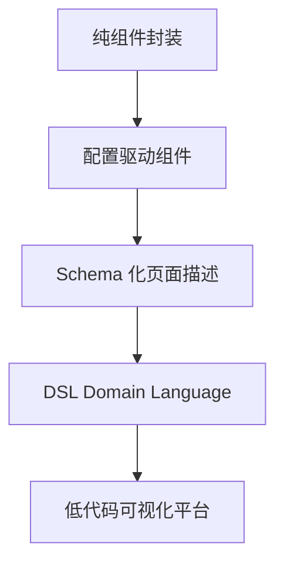

出处：[掘金](https://juejin.cn/post/7527672138305273891)

原作者：金泽宸

---

> 构建一个“配置即页面”的系统，不是为了少写代码，而是为了少改代码

# 写在前面

当前端系统规模日益庞大、业务变更频繁时，我们需要==从“写死代码”转变为“平台配置驱动”==：

- 让运营能拖拽生成页面
- 让产品能配置组件逻辑
- 让前端只需维护平台架构和低代码引擎

这一篇，我们系统拆解可配置平台的演进路径：组件 → schema → DSL → 可视化低代码平台

# 典型场景：为什么要可配置？

|场景|原始方式|配置方式|
|---|---|---|
|广告位/弹窗投放|写死 `if (city == '广州')`|后台配置 city = 广州|
|营销活动页|每次新建页面|拖拽组件配置活动|
|表单页|页面硬编码输入框|JSON schema 生成表单|
|数据展示|表格字段固定|动态配置列、筛选、接口|
|H5 落地页|多版本维护|单引擎 + 配置区分|

# 平台演进路线



## 第一阶段：组件封装

例如封装一个 Banner 组件：

```vue
<template>
  
</template>

<script setup>
defineProps(['data'])
</script>
```

用户通过：

```vue
<Banner :data="xxx" />
```

缺点是页面结构和内容写死

##  第二阶段：配置驱动组件渲染

使用配置 JSON 渲染多个组件：

```ts
const pageConfig = [
  { type: 'banner', props: { imgUrl: '/a.jpg' } },
  { type: 'form', props: { fields: [...] } },
  { type: 'table', props: { columns: [...], api: '/list' } }
]
```

动态渲染：

```vue
<component :is="resolveComponent(cfg.type)" v-bind="cfg.props" v-for="cfg in pageConfig" />
```

`resolveComponent` 映射到注册组件即可

## 第三阶段：页面级 Schema 驱动

借助 JSON Schema 或自定义结构：

```json
{
  "page": {
    "title": "用户列表",
    "body": [
      { "type": "searchForm", "fields": ["name", "age"] },
      { "type": "dataTable", "columns": ["name", "age"], "api": "/api/user/list" }
    ]
  }
}
```

优势：

- 配置结构统一
- 支持权限、权限码、条件展示等逻辑嵌套
- 页面=数据，无需写前端

## 第四阶段：抽象领域 DSL

引入领域语言 DSL（Domain Specific Language），封装业务语义：

```yaml
page:
  title: 用户中心
  layout: vertical
  components:
    - $form:
        bind: userForm
        fields:
          - $input: { label: 姓名, key: name }
          - $select: { label: 性别, key: gender, options: 男/女 }
    - $dataTable:
        bind: userList
        api: /api/user/list
        columns: [name, gender]
```

优势：

- 易读性强
- 与业务语义解耦（非组件）
- 可导出/导入、版本化、存储数据库

## 第五阶段：可视化低代码平台

引擎层核心模块：

|模块|功能|
|---|---|
|组件库|所有渲染组件（Banner, Table, Form）|
|渲染引擎|把 DSL 渲染成组件结构|
|事件系统|处理交互/跳转/API|
|权限系统|控制组件显隐、可点击|
|发布系统|配置版本管理/灰度上线|

现成方案：

- 百度 [amis](https://baidu.github.io/amis/zh-CN/docs/index)
- 阿里 [lowcode-engine](https://lowcode-engine.cn/index)

核心代码：渲染引擎简版

```js
function renderSchema(schema) {
  return schema.components.map(cfg => {
    const Comp = componentMap[cfg.type]
    return <Comp {...cfg.props} />
  })
}
```

支持嵌套、权限、条件展示：

```js
if (cfg.permission && !hasPermission(cfg.permission)) return null
if (cfg.visible === false) return null
```

# 平台与团队协作模式重构

| 角色  | 职责              |
| --- | --------------- |
| 前端  | 构建组件/引擎/渲染器     |
| 产品  | 配置页面结构          |
| 运营  | 搭建活动页           |
| 后端  | 提供数据接口          |
| QA  | 复用 DSL 进行测试用例生成 |
