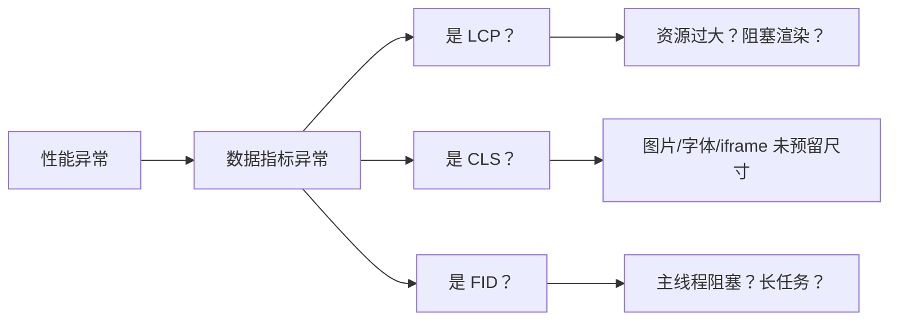
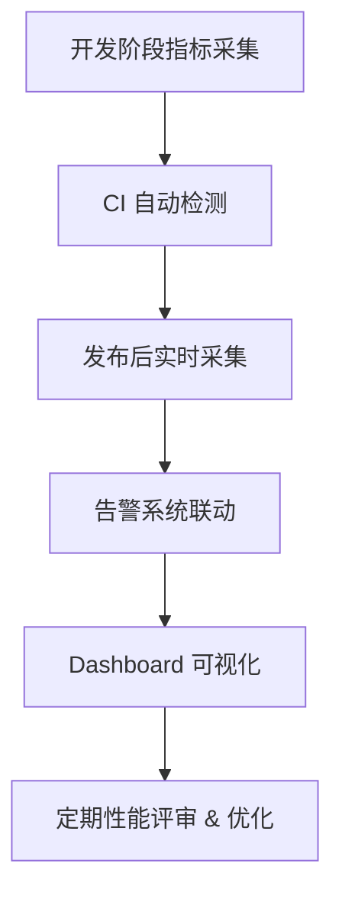

出处：[掘金](https://juejin.cn/post/7527633170317967360)

原作者：金泽宸

---

> 性能不是“一个优化点”，而是==可持续的体系==，每个页面、每个版本、每个指标都要有==数据支撑与监控闭环==

# 写在前面

前端性能的好坏，直接决定了用户是否留存

其实性能优化，前端能做的事情比较有限，但不做可能体验非常难受

本篇聚焦“体系化性能优化”思维，不再是“某个点的优化”，而是：

- 如何定义性能指标？
- 如何定位性能瓶颈？
- 如何建立自动化监控和告警体系？

适用于大中型系统的全链路实战落地

# 明确性能指标体系

前端常见核心指标如下：

|维度|指标|含义|
|---|---|---|
|加载|FCP|首次内容绘制|
|加载|LCP|最大内容绘制（感知加载完）|
|交互|FID|首次输入延迟|
|稳定|CLS|布局偏移|
|响应|TTFB|首字节到达时间|
|综合|TTI|可交互时间点|
|主动|自定义点|首页加载/接口响应/路由切换等|

我们重点关注：

- 用户感知加载速度（LCP/TTI）
- 页面稳定性（CLS）
- 用户行为体验（FID）

# 性能瓶颈定位流程图



# 加载性能优化实战

## 样式资源优化

```html
<!-- 使用 preload 提前加载关键资源 -->
<link rel="preload" href="/main.css" as="style" onload="this.rel='stylesheet'">
```

- 使用 `<link rel="preload">` 提前加载首屏 CSS
- 合理拆分 CSS（例如组件级 lazy-css）

## 图片懒加载 + WebP

```html

```

- 使用 `loading=lazy` 原生懒加载
- 使用 WebP 替代 JPG/PNG，体积减少约 30%

## 第三方库优化

```js
// 替换 moment 为 dayjs，体积从 350kb → 2kb
import dayjs from 'dayjs'
```

## bundle 分析工具推荐

```ts
// vite.config.ts
import visualizer from 'rollup-plugin-visualizer'
plugins: [visualizer({ open: true })]
```

# 交互性能优化实战

## 处理长任务

```js
// 避免阻塞主线程，拆解大型计算任务
setTimeout(() => chunkedCompute(), 0)
```

使用 `requestIdleCallback` / `web worker` 拆分耗时逻辑

## 首屏不渲染不可见 DOM

```vue
<LazyComponent v-if="isInView" />
```

结合 `IntersectionObserver` 做组件级懒加载

## Event 优化

```js
// 滚动节流
window.addEventListener('scroll', throttle(handle, 100))
```

# 缓存策略优化

从首屏秒开到动态预取

|缓存类型|示例|
|---|---|
|HTTP Cache|`Cache-Control: max-age=31536000`|
|本地缓存|localStorage / sessionStorage|
|CDN 缓存|JS、CSS、图片等静态资源|
|预取|`<link rel="prefetch">`|
|service worker|PWA 离线缓存|

结合接口缓存：

```js
const cache = new Map()
if (cache.has(url)) return cache.get(url)
const res = await fetch(url)
cache.set(url, res)
```

# 性能监控实战接入（Lighthouse + Web Vitals + Sentry）

## 自动性能打分

```shell
npx lighthouse https://your-site.com --view
```

- 自动生成分析报告（FCP、LCP、CLS 等）
- 可集成到 CI 持续检查

## Web Vitals 采集

```js
import { getLCP, getFID, getCLS } from 'web-vitals'
getLCP(console.log)
getFID(console.log)
getCLS(console.log)
```

## 接入 Sentry 性能分析

```js
Sentry.init({
  dsn: 'xxx',
  integrations: [new Sentry.BrowserTracing()],
  tracesSampleRate: 1.0
})
```

自动记录：

- 页面加载时间
- 慢资源/长任务
- JS 报错栈信息


# 打造性能闭环体系


