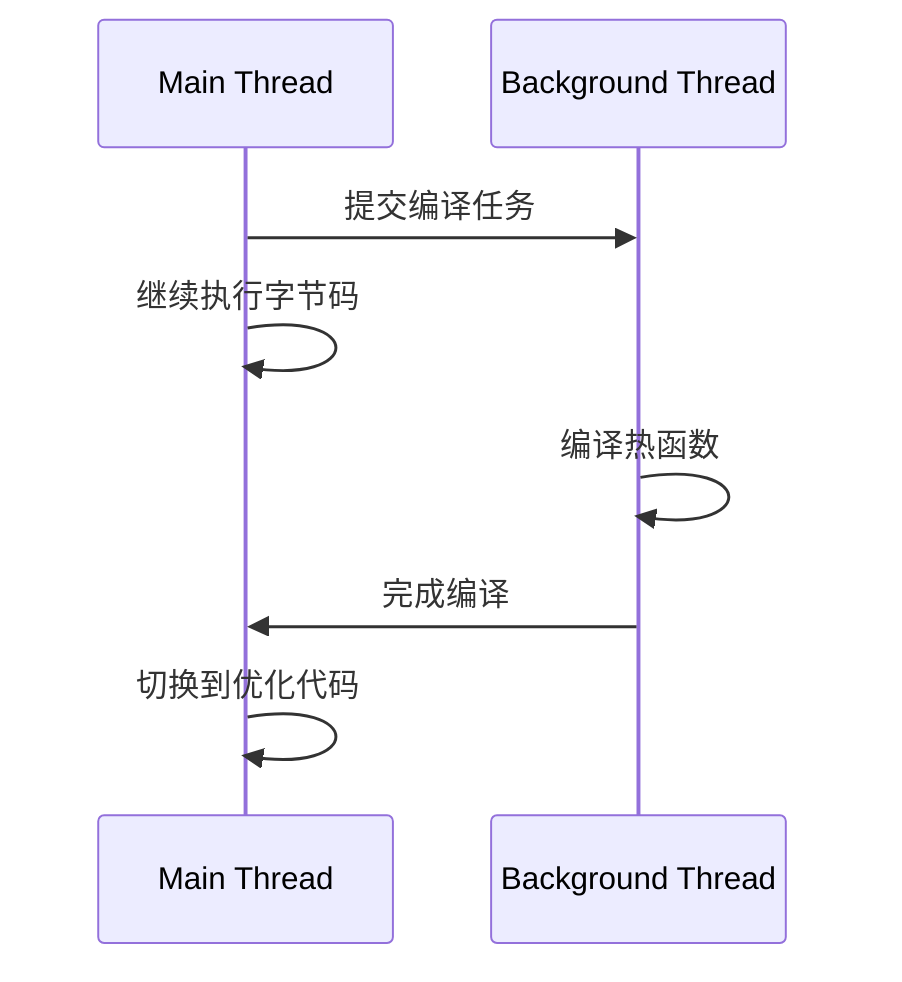

# 什么是 V8

V8 是一个由 Google 开发的开源 JavaScript 引擎（也称 JavaScript 虚拟机），目前用在 Chrome 浏览器和 Node.js 中，其核心功能是执行 JavaScript 代码

![[Pasted image 20240829144328.png]]

目前市面上有很多种 JavaScript 引擎，诸如 SpiderMonkey、V8、JavaScriptCore 等。而 V8 是当下使用最广泛的 JavaScript 引擎，我们写的 JavaScript 应用，大都跑在 V8 上

V8 之所以如此受欢迎，和它许多革命性的设计是分不开的：

- V8 率先引入了即时编译（JIT）的双轮驱动的设计，这是一种权衡策略，混合编译执行和解释执行这两种手段，给 JavaScript 的执行速度带来了极大的提升
- V8 引入了惰性编译、内联缓存、隐藏类等机制，进一步优化了 JavaScript 代码的编译执行效率
- ...

可以说，V8 的出现，将 JavaScript 虚拟机技术推向了一个全新的高度

# V8 如何执行 JavaScript 代码

V8 是一个虚拟机，具有自己的一套指令系统，它屏蔽了不同体系结构计算机（如：不同的 CPU 指令集）、不同操作系统的差异

V8 并没有采用某种单一的解释执行或编译执行，而是混合这两种手段，我们把这种混合使用编译器和解释器的技术称为 JIT（Just In Time）技术

这是一种权衡策略，因为这两种方法都各自有自的优缺点：解释执行的启动速度快，但是执行时的速度慢；而编译执行的启动速度慢，但是执行时的速度快

![[Pasted image 20240829161403.png]]

1. V8 启动时需要初始化一些基础环境，包括：
	- 栈空间
	- 堆空间
	- 全局执行上下文：包含了执行过程中的全局信息，如一些内置函数，全局变量等
	- 全局作用域：包含了一些全局变量
	- 消息循环系统：包含消息驱动器和消息队列
	- ...
2. V8 接收到要执行的 JavaScript 源代码字符串
3. 通过解析器解析成抽象语法树（[[002.抽象语法树|AST]]），同时生成相关的作用域，用于存放相关变量
4. 之后就可以生成字节码了，字节码是介于 AST 和机器代码的中间代码。与特定类型的机器代码无关
5. 解释器可以直接解释执行字节码，并输出执行结果
6. 解释执行字节码的过程中，有一个监控模块。如果发现了某一段代码会被重复多次执行，那么就会将这段代码标记为热点代码
7. 热点代码（字节码）会被编译器编译为二进制机器代码，由 CPU 直接执行。如果下次再执行到这段代码时，会优先选择优化之后的二进制代码，大幅提升执行速度
8. 由于 JavaScript 是一种非常灵活的动态语言，对象的结构和属性是可以在运行时任意修改的，而经过编译器优化过的代码只能针对某种固定的结构，一旦在执行过程中，对象的结构被动态修改了，就需要执行反优化操作，回退到解释器解释执行

# JIT

> "JIT不是简单的即时编译，而是在运行时持续优化的动态过程。它让 JavaScript 从解释型语言的性能泥潭中腾飞，成为现代高性能应用的基石。" - V8 引擎首席工程师

在 JS 的性能进化史上，JIT(Just-In-Time) 编译技术无疑是革命性的突破。作为 Google Chrome 浏览器和 Node.js 的强大心脏，V8 引擎通过 JIT 技术彻底改变了 JS 的执行方式，将一门解释型语言提升到接近原生应用的执行速度

## 解释型 VS. 编译型：性能困境

要理解 JIT 的价值，首先需要了解传统语言的执行方式差异：

- 解释型语言：运行时逐行解释执行，启动快但执行慢
- 编译型语言：提前编译为机器码，启动慢但执行快

JS 作为解释型语言曾因性能问题饱受诟病，直到 V8 引擎引入 JIT 技术，完美结合了两者优点

## JIT 的核心思想：运行时编译

JIT(Just-In-Time) 即时编译的核心思想是：在程序运行时将热点代码（频繁执行的代码）编译为机器码，后续执行直接运行编译后的高效机器码

# V8 引擎的核心组件解析

## Ignition：高效率的解释器

作为 V8 的第一个执行层，Ignition 负责：

- 将 AST 转换为紧凑的字节码(bytecode)（这里的字节码实际是上图中的中间代码，并不是二进制机器码）
- 执行字节码并收集类型反馈 (type feedback)
- 识别热点函数准备编译

```js
// JavaScript 代码示例
function sum(arr) {
  let total = 0;
  for (let i = 0; i < arr.length; i++) {
    total += arr[i];
  }
  return total;
}

// 简化版字节码示例 (实际更复杂)
LdaZero           // 加载 0 到累加器
Star total        // 存储到变量 total

LdaSmi [0]        // 加载 0
Star i            // 存储到变量 i

Loop:
// ... 循环体字节码
```

## TurboFan：强大的优化编译器

当 Ignition 识别出热点函数后，TurboFan 接手进行深度优化：


TurboFan 的核心优化技术包括：

1. 内联缓存(Inline Caching)
2. 类型特化(Type Specialization)
3. 函数内联(Function Inlining)
4. 逃逸分析(Escape Analysis)
5. 死代码消除(Dead Code Elimination)

类型特化示例：

```js
// 原始函数
function add(a, b) {
  return a + b;
}

// 当观察到 a 和 b 总是数字时，生成特化版本
function optimized_add(a, b) {
  // 直接使用 CPU 的数字加法指令
  // 跳过类型检查
  return a + b;
}
```

函数内联示例：

```js
// 原始代码
function calculate(a, b) {
  return add(a, b) * 2;
}

// 内联优化后等效代码
function optimized_calculate(a, b) {
  // 直接展开 add 函数体
  return (a + b) * 2;
}
```

## 去优化(Deoptimization)：安全网机制

当 TurboFan 的假设被违反时（如传入不同类型参数），执行会回退到解释器：

```js
// 原本优化的数字相加
add(2, 3); // 优化版本执行

// 传入字符串导致优化失效
add("Hello", "World"); // 触发去优化，回退到解释器执行
```

# JIT 优化解析

## 隐藏类(Hidden Classes)与内联缓存

JS 作为动态语言，属性访问传统上很慢

```js
function Person(name, age) {
  this.name = name;
  this.age = age;
}

const p1 = new Person("Alice", 30);
const p2 = new Person("Bob", 25);

// 访问属性优化过程：
// 1. V8 创建隐藏类 C0
p1.name; // 查找开销大

// 2. 添加 name 属性，创建隐藏类 C1（继承 C0）
// 3. 添加 age 属性，创建隐藏类 C2（继承 C1）

// 内联缓存记住属性位置
// 后续访问直接使用偏移量
```

## 逃逸分析优化

```js
function createPoint(x, y) {
  return { x, y };
}

function calculate() {
  const points = [];
  for (let i = 0; i < 1000; i++) {
    // 对象不逃逸出函数作用域
    points.push(createPoint(i, i*2));
  }
  return points;
}

// TurboFan 优化后：
// 直接在栈上分配对象，避免堆分配开销
```

# 实际应用场景

## 编写 JIT 友好的代码

```js
// 避免：多态函数
function process(value) {
  // 不同类型的 value 会使优化失效
  return value.x + value.y;
}

// 推荐：保持参数类型一致
function processNumbers(point) {
  return point.x + point.y;
}
```

## 利用内联缓存

```js
// 创建对象时保持相同顺序
// 确保共享隐藏类

// 好：属性顺序一致
const obj1 = { a: 1, b: 2 };
const obj2 = { a: 3, b: 4 };

// 差：属性顺序不同
const obj3 = { a: 1, b: 2 };
const obj4 = { b: 4, a: 3 }; // 不同的隐藏类
```

## 函数热度的合理控制

适中的函数大小：

- 过小：内联更高效
- 过大：编译时间过长

理想的热点函数：

- 100-1000 次调用
- 代码行数：5-50 行为佳

# JIT 的挑战与解决方案

## 编译开销问题

JIT 需要在运行时编译，可能影响启动性能：

V8 解决方案：

- 分层编译：先快速生成简单机器码，再逐步优化
- 编译缓存：缓存热函数的编译结果

## 内存开销问题

存储字节码和编译后的机器码会增加内存：

V8 解决方案：

- 高效的字节码格式（比源码小 5-10 倍）
- 懒编译：只编译热函数
- 去优化后回收未使用的机器码

## 代码复杂性问题

现代 JS 语言的特性增加编译复杂性：

V8 解决方案：

- 灵活的 IR 设计
- 成熟的 AST 转换系统
- 强大的优化器架构

# V8 JIT 的未来演进

## 并发编译

允许 JS 执行与编译同时进行，减少卡顿：



## 机器学习优化的启发式算法

使用机器学习预测哪些函数最值得优化

训练数据：

- 函数特征：大小，调用次数，内部循环，参数类型等
- 优化收益：执行时间减少比例

预测模型：

- 输入：新函数的特征
- 输出：优化的预期收益

## WebAssembly 集成

通过 WebAssembly 利用更多编译优化可能性：

```js
// 将关键函数编译为 WebAssembly
const wasmCode = new Uint8Array([...]);
const module = new WebAssembly.Module(wasmCode);
const instance = new WebAssembly.Instance(module);

// 调用高性能版本
const result = instance.exports.optimizedFunction();
```
