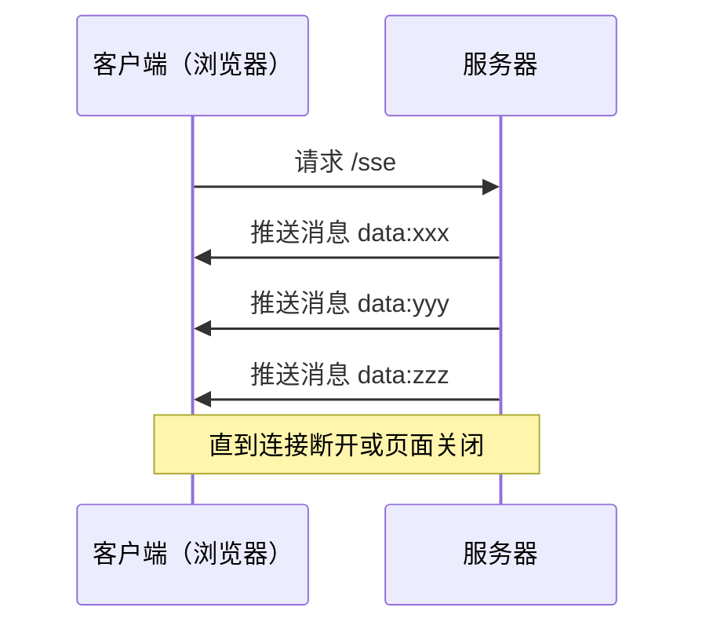
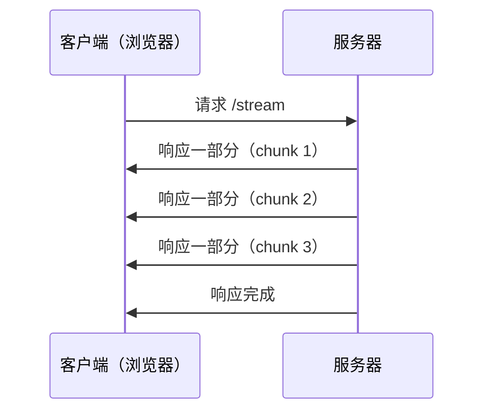

出处：[掘金](https://juejin.cn/post/7535277408704299049)

原作者：小old弟

---

2025 年 5 月 9 日，MCP（Model Context Protocol）迎来重磅升级—— Streamable HTTP 正式发布，取代了 HTTP SSE，成为 AI 模型通信的新标准！

前段搞了个 SSE，全都弃了，现在全是 Streamable HTTP，它是啥？为啥有全用这种协议，有什么好处，使得弃了前者，爱上后者

# SSE (Server-Sent Events)

刚出来大模型 AI 的时候，SSE 这种协议各大网络平台全是它

SSE (Server-Sent Events)：基于 HTTP 协议，浏览器从服务器接收持续数据更新的技术。客户端发起请求后，服务器可以不断向客户端“推送”信息，直到断开



特点：浏览器发起一次请求后，**服务器不断地推送数据，自动保持连接**

用 Node.js express 写的后端：

```js
// sse-server.js
const express = require('express');
const app = express();

app.get('/sse', (req, res) => {
  res.set({
    'Content-Type': 'text/event-stream',
    'Cache-Control': 'no-cache',
    'Connection': 'keep-alive'
  });

  let counter = 0;

  const timer = setInterval(() => {
    counter++;
    res.write(`data: 第 ${counter} 条消息\n\n`);

    if (counter >= 10) {
      clearInterval(timer);
      res.end(); // 关闭连接
    }
  }, 1000);
});

app.listen(3000, () => {
  console.log('SSE 服务运行在 http://localhost:3000/sse');
});
```

后端响应格式：

```http
HTTP/1.1 200 OK
Content-Type: text/event-stream

data: 这是第一条消息
data: 第二条消息来了
```

前端代码：

```js
const source = new EventSource('/sse');

source.onmessage = (event) => {
  console.log('收到消息：', event.data);
};
```

# Streamable HTTP

Stream 流：在 HTTP 请求或响应过程中，内容像水流一样逐段发送，而不是等待全部内容生成完成再发。分块传输



特点：服务器会**一边处理一边发送内容**，适用于大数据、长处理时间的场景

用 Node.js express 写的后端：

```js
// stream-server.js
const express = require('express');
const app = express();

app.get('/stream', (req, res) => {
  res.setHeader('Content-Type', 'text/plain');
  res.setHeader('Transfer-Encoding', 'chunked');

  let count = 0;
  const timer = setInterval(() => {
    count++;
    res.write(`chunk #${count}\n`);

    if (count >= 5) {
      clearInterval(timer);
      res.end('--- 结束 ---\n');
    }
  }, 1000);
});

app.listen(3001, () => {
  console.log('Stream 服务运行在 http://localhost:3001/stream');
});
```

后端响应格式：

```http
HTTP/1.1 200 OK
Content-Type: text/plain
Transfer-Encoding: chunked

data: 这是第一条消息
data: 第二条消息来了
```

前端代码：

```js
fetch('http://localhost:3001/stream')
    .then(response => response.body.getReader())
    .then(reader => {
      const decoder = new TextDecoder();
      return reader.read().then(function process({ done, value }) {
        if (done) return;
        console.log('流内容：', decoder.decode(value));
        return reader.read().then(process);
      });
    });
```

# MCP 服务器

MCP 服务器，在 stream 之前，有过 sse 和 stdio

- stdio 只局限于本地环境。做些简单的网络请求（如查询添加）、简单运算（加减乘除）这些，跟本地算力有关，不能用于企业级
- sse 单向推事件给客户端。有两种通信通道：HTTP 请求/响应，服务器推送事件：专门的 `/sse` 端点推送信息。但有缺点（关键问题）：
    - **不支持断线重连/恢复**：SSE 连接断开所有会话状态丢失，客户端必须重新建立连接并初始化整个会话
    - **服务器需维护长连接**：服务器必须为每个客户端维护一个长时间的 SSE 连接，大量并发用户会导致资源消耗剧增，当服务器重启或扩容时所有连接会中断影响用户体验和系统可靠性
    - **服务器消息只能通过 SSE 传递**：即使是简单的请求-响应交互、服务器也必须通过 SSE 通道返回信息，这就需要服务器一直保持 SSE 连接，造成不必要的复杂性和开销
    - **基础设施兼容性限制**：目前很多 Web 基础设施，如 CDN、负载均衡器、API 网关等，对长时间 SSE 连接支持性不够，企业防火墙有可能强制关闭超时 SSE 连接，造成连接不可用

在深入理解 Streamable HTTP 的设计原理后，我们再来看看它是如何解决 SSE (Server-Sent Events) 的四个关键问题的。这些问题的解决方式将帮助我们更透彻地掌握 Streamable HTTP 协议的优势

## 问题 1：不支持断线重连/恢复

SSE 在连接中断后，客户端需要重新建立连接并手动恢复数据流。而 Streamable HTTP 在每次通信时会记录**唯一 ID**，用于标识请求与响应对应关系。服务器和客户端均可存储这些 ID，从而实现**自动断线重连与数据恢复**，避免数据丢失或重复传输

```python
# SSE 需要手动重连
client.connect()  # 断开后需重新建立连接

# Streamable HTTP 自动恢复
response = client.request(id=last_id)  # 使用 ID 续传
```

## 问题 2：服务器需维护长连接

SSE 依赖**持久化长连接**，导致服务器资源占用较高。而 Streamable HTTP 采用**按需保持连接**的策略：

- 传输过程中：保持连接以确保流式数据的完整性
- 传输结束后：服务器**立即关闭连接**，释放资源，避免不必要的开销

```js
// SSE 保持长连接
const sse = new EventSource("/stream"); // 持久化连接

// Streamable HTTP 按需连接
fetch("/stream").then(stream => {
  // 流结束自动关闭
});
```

## 问题 3：服务器消息只能通过 SSE 传递

SSE 强制使用 `text/event-stream` 格式，灵活性较低。Streamable HTTP 则支持**动态响应模式**：

- 普通 HTTP 响应：适用于简单请求（如一次性数据返回）
- SSE 流式响应：适用于实时数据推送（如日志流、金融行情）

服务器可根据场景**智能切换模式**，提高协议适用性

```http
# SSE 强制使用 event-stream
GET /updates HTTP/1.1
Accept: text/event-stream

# Streamable HTTP 智能选择
GET /data HTTP/1.1
Accept: application/json or text/event-stream
```

## 问题 4：基础设施兼容性限制

SSE 在某些代理、CDN 或旧版网关中可能受限。而 Streamable HTTP 在设计时充分考虑了**兼容性**，确保能在各类网络设备、云服务及企业级架构中无缝运行，尤其适合 MCP（多云平台）等复杂环境

SSE 可能被代理拦截：

```nginx
location /sse { proxy_set_header Connection ""; }
```

Streamable HTTP 标准 HTTP 兼容：

```nginx
location /stream { proxy_pass http://backend; }
```

# 总结

- SSE 适用于服务器主动**推送通知/事件**的场景
- Streamable HTTP 适用于传输**大内容、慢内容、流式内容**的场景（如 ChatGPT 输出、视频、数据列表）
