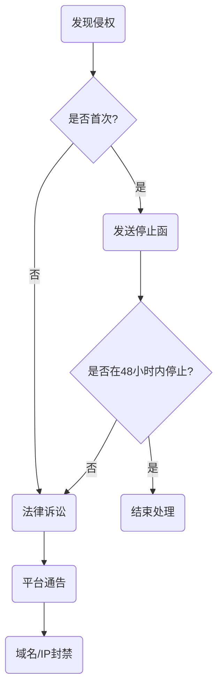
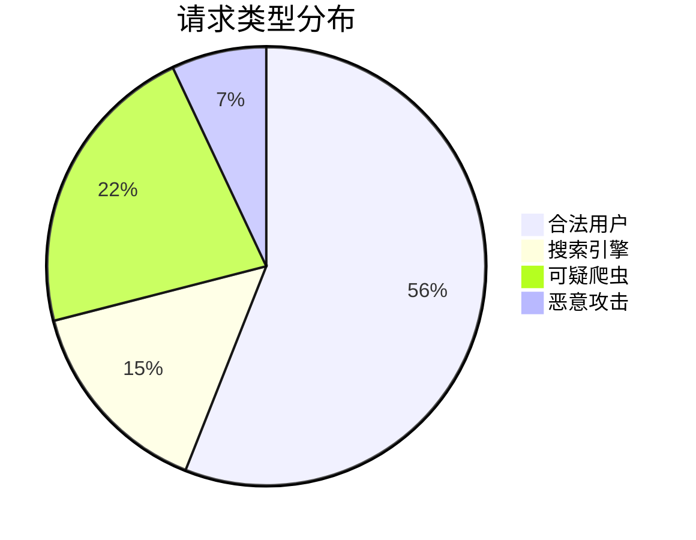
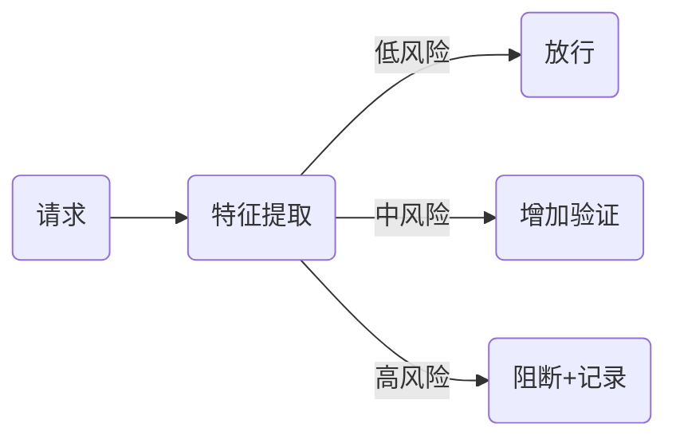

出处：[掘金](https://juejin.cn/post/7521642915279601718)

原作者：前端微白

---

在当今数据驱动的数字世界，==网站数据已成为商业竞争的核心资产==。根据最新研究，恶意爬虫活动已占所有网站流量的 40% 以上，给企业造成每年数百亿美元的损失。本文将深入探讨网站防护爬虫的全套策略与技术方案

# 为什么爬虫防护至关重要？

数据被爬取的典型后果：

1. 内容剽窃：原文被复制导致 SEO 竞争力下降
2. 价格监控：竞争对手实时追踪你的定价策略
3. 账户破解：撞库攻击危及用户数据安全
4. 资源耗尽：服务器过载影响正常用户访问
5. 数据泄露：敏感商业信息被窃取

# 基础防护层：搭建第一道防线

## 请求头分析与过滤

```js
// Express 中间件示例：检测常见爬虫 User-Agent
const blockedUserAgents = [
  'Scrapy', 'HttpClient', 'Python-urllib', 
  'curl', 'Java', 'bot', 'spider'
];

app.use((req, res, next) => {
  const userAgent = req.headers['user-agent'] || '';
  
  if (blockedUserAgents.some(agent => userAgent.includes(agent))) {
    // 记录可疑访问
    logSuspiciousRequest(req);
    return res.status(403).send('Access denied');
  }
  
  // 验证其他关键头信息
  if (!req.headers['accept-language'] || !req.headers['accept']) {
    // 缺少基础头信息可能是爬虫
    delayResponse(res, 5000); // 延迟响应增加爬虫成本
  }
  
  next();
});
```

## IP 频率限制策略

```nginx
# Nginx 配置：限制单 IP 请求频率
http {
  limit_req_zone $binary_remote_addr zone=api_limit:10m rate=10r/s;
  
  server {
    location /api/ {
      limit_req zone=api_limit burst=20 nodelay;
      proxy_pass http://backend;
    }
  }
}
```

分级限制策略：

- 普通用户：< 10 请求/秒
- API 客户端：< 5 请求/秒（需携带有效令牌）
- 新 IP 地址：< 3请求/秒（前 5 分钟）

## 验证码智能介入

验证策略选择指南：

| 场景   | 推荐方案         | 用户体验影响   |
| ---- | ------------ | -------- |
| 登录失败 | reCAPTCHA v3 | 低（后台评分）  |
| 敏感操作 | hCAPTCHA     | 中等（简单挑战） |
| 高频访问 | 数学题/Puzzle   | 中等（轻度中断） |
| 可疑行为 | 高级图像识别       | 高（需要交互）  |

```js
// Google reCAPTCHA v3 后端验证
async function verifyCaptcha(token) {
  const secret = process.env.RECAPTCHA_SECRET;
  const url = `https://www.google.com/recaptcha/api/siteverify?secret=${secret}&response=${token}`;
  
  const response = await fetch(url, { method: 'POST' });
  const data = await response.json();
  
  // 基于评分执行操作
  if (data.score < 0.5) {
    // 高风险请求：增强验证
    requireAdvancedVerification();
  }
  return data.success;
}
```

# 进阶防护层：行为分析与陷阱

## 用户行为指纹技术

构建唯一指纹标识：

```js
function generateBrowserFingerprint(req) {
  const { headers, connection } = req;
  
  return createHash('sha256').update(
    headers['user-agent'] +
    headers['accept-language'] +
    headers['accept-encoding'] +
    connection.remoteAddress +
    headers['upgrade-insecure-requests'] +
    // 添加更多特征值...
  ).digest('hex');
}
```

异常行为检测算法：

```python
# Python 伪代码：检测异常浏览模式
def detect_abnormal_behavior(behavior_log):
  # 分析行为特征
  avg_page_time = np.mean(behavior_log['page_times'])
  mouse_movement = behavior_log['mouse_movement_variance']
  click_pattern = analyze_click_pattern(behavior_log['clicks'])
  
  # 构建决策模型
  risk_score = 0
  
  # 异常特征加权
  if avg_page_time < 2.0:  # 低于正常浏览时间
    risk_score += 30
  if mouse_movement < 5.0:  # 鼠标移动方差低
    risk_score += 25
  if click_pattern == 'linear':  # 点击模式线性
    risk_score += 35
  if behavior_log['scroll_depth'] > 0.9:  # 深度滚动但停留时间短
    risk_score += 25
  
  return risk_score > 70  # 阈值判定
```

## 动态内容防护系统

反爬虫页面元素策略：

```html
<div class="product-price" data-real-price="29.99">
  <!-- 干扰信息 -->
  <span style="display:none">$35.00</span>
  <span class="decoy-price">$32.99</span>
  
  <!-- 真实价格通过 JS 渲染 -->
  <script>
    document.write('<span class="real-price">'
      + document.currentParent.getAttribute('data-real-price')
      + '</span>');
  </script>
</div>

<!-- 蜜罐陷阱 -->
<div style="display: none;" class="honeypot">
  <a href="/internal/suspicious/trap">隐藏链接</a>
</div>
```

API 防护策略：

```js
// 动态 API 令牌生成
let apiToken = generateDynamicToken();

// 每 5 分钟刷新令牌
setInterval(() => {
  apiToken = generateDynamicToken();
}, 300000);

// 在 API 响应中包含下一个令牌
app.get('/api/products', (req, res) => {
  const data = fetchProductData();
  
  res.json({
    data,
    nextToken: apiToken
  });
});

// 要求客户端在下一个请求中使用新令牌
app.post('/api/action', (req, res) => {
  if (req.body.token !== apiToken) {
    logSuspiciousActivity(req);
    delayResponse(res, 8000); // 增加延迟惩罚
    return res.status(400).json({ error: '无效令牌' });
  }
  // 处理合法请求...
});
```

## 机器学习驱动的威胁检测

```python
# 使用 Scikit-learn 构建爬虫检测模型
from sklearn.ensemble import RandomForestClassifier
import pandas as pd

# 样本数据集（特征工程）
data = pd.read_csv('access_logs_features.csv')

features = data[['req_rate', 'session_duration', 
                'page_velocity', 'click_diversity', 
                'mouse_movement', 'scroll_depth']]
target = data['is_bot']

# 训练检测模型
model = RandomForestClassifier(n_estimators=100)
model.fit(features, target)

# 实时检测函数
def detect_bot_in_real_time(request_features):
    prediction = model.predict([request_features])
    probability = model.predict_proba([request_features])
    
    # 高风险且概率>90%则拦截
    if prediction[0] == 1 and probability[0][1] > 0.9:
        block_request()
        log_attack_attempt()
    elif probability[0][1] > 0.7:
        require_captcha()
```

# 基础架构防护层

## Web 应用防火墙（WAF）配置规则

关键防护规则集：

```nginx
# ModSecurity 核心规则
SecRuleEngine On

# 常见爬虫拦截
SecRule REQUEST_HEADERS:User-Agent "@pm curl wget java python scrapy" \
  "phase:1,id:1000,deny,msg:'Blocked bot user-agent'"

# 防护数据抓取模式
SecRule REQUEST_BASELINE:rate "@gt 60" \
  "phase:2,id:1001,deny,msg:'Request rate too high'"

# 反自动化探测
SecRule REQUEST_URI "@contains /admin" \
  "chain,phase:2,id:1002"
SecRule &REQUEST_HEADERS:Authorization "@eq 0" \
  "deny,msg:'Admin access without auth'"

# 隐藏数据探测防护
SecRule REQUEST_URI "@endsWith .git" \
  "phase:1,id:1003,deny,msg:'Git repository access attempt'"
```

## 分布式防御系统架构

多层防护架构设计：

```text
用户请求 → [CDN] 
        → [边缘防火墙] 
        → [行为分析引擎] 
        → [API网关] 
        → [应用服务]
        ↓
[实时监控告警] ↔ [威胁情报平台]
```

核心组件功能：

- CDN 层面：DDoS 防护、地理封锁、基础请求过滤
- 边缘节点：JavaScript 挑战、速率限制
- API 网关：令牌验证、请求签名、参数校验
- 行为分析：实时评分、机器学习模型应用
- 威胁情报：共享黑名单、模式数据库、自动化响应

# 法律与合规保护

## 机器人排除协议增强

`robots.txt` 高级配置：

```txt
User-agent: *
Disallow: /api/
Disallow: /private/
Disallow: /user-profiles/
Disallow: /prices/

# 法律声明
Crawl-delay: 10
Request-rate: 1/5
Comments: 此网站的抓取需获得书面授权。违规者将面临法律诉讼。
```

## DMCA 侵权响应流程

1. 自动化监控：使用版权内容扫描服务
2. 证据存档：完整爬取日志和 IP 信息
3. 法律通知：向侵权方发送停止函
4. 平台通告：通知搜索引擎/托管服务商
5. 诉讼准备：证据保全和技术验证

应对框架：



# 持续防护体系

## 监控与响应机制

关键监控指标仪表盘：



实时告警规则示例：

```yaml
# Prometheus 警报配置
groups:
- name: crawler-detection
  rules:
  - alert: HighBotTraffic
    expr: sum(rate(requests_total{type="suspicious"}[5m])) > 100
    for: 10m
    labels:
      severity: critical
    annotations:
      summary: "检测到异常爬虫流量激增"
      description: "过去10分钟内可疑请求达到 {{ $value }} 次/分钟"
      
  - alert: DataScrapingPattern
    expr: rate(data_access{category="products"}[1h]) > 200
    labels:
      severity: warning
    annotations:
      description: "产品页面的异常高频访问"
```

# 反爬虫防御体系评估

| 防御等级    | 防护措施         | 覆盖攻击类型          | 实施复杂度 |
| ------- | ------------ | --------------- | ----- |
| **基础级** | 请求头检查、速率限制   | 初级脚本、通用爬虫       | ★☆☆☆☆ |
| **进阶级** | 行为分析、JS挑战、蜜罐 | 中级爬虫、自动化脚本      | ★★★☆☆ |
| **专家级** | 机器学习模型、动态指纹  | 高级爬虫、Selenium模拟 | ★★★★☆ |
| **企业级** | WAF整合、分布式防护  | 分布式爬虫、专业采集      | ★★★★★ |

# 最佳实践总结

1. 深度防御原则：采用多层叠加防护策略，应用层 -> 行为分析 -> API 防护 -> 基础设施防护
2. 成本提升策略：增加爬虫的数据获取成本，简单防护 -> 增加延迟 -> 需要人工干预 -> 法律风险
3. 智能自适应防护：



4. 持续演进：每月更新防御规则和检测模型，基础规则更新 -> 行为模型训练 -> 红蓝对抗 -> 架构优化

# 小结

防止网站被爬取不是一劳永逸的任务，而是==持续演进的攻防博弈==。有效的防护策略需平衡：

1. 安全性：保护核心数据和业务资源
2. 用户体验：避免过度干扰真实用户
3. 成本投入：优化防御资源分配
4. 法律合规：合理行使数据权利

> Google 工程总监 Martin Splitt 指出："最好的反爬虫策略是让合规访问更容易，非法爬取成本更高。"
