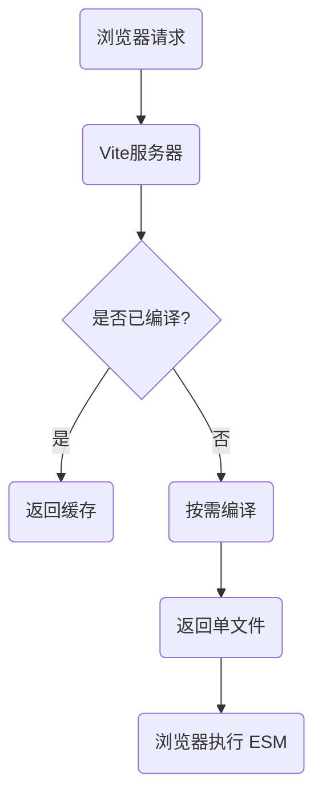
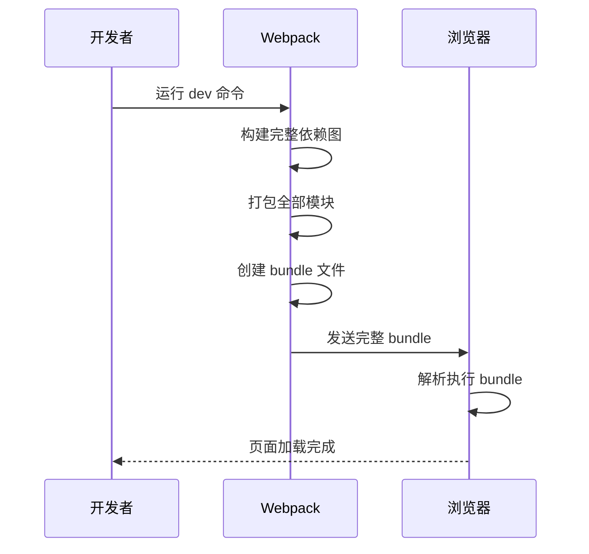
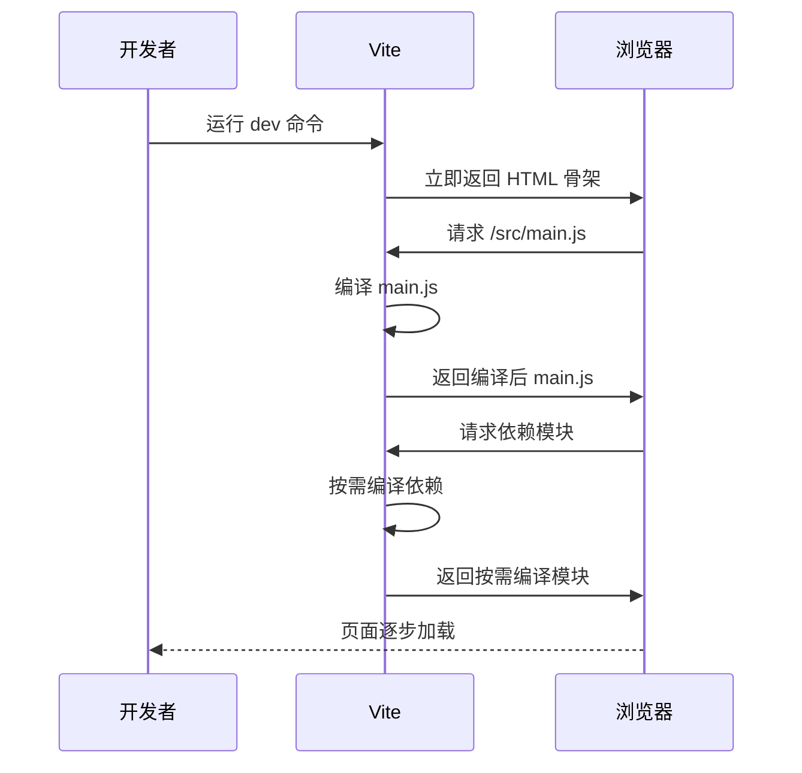
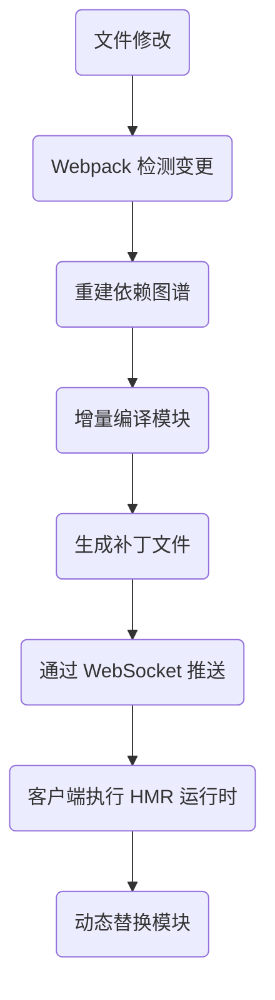
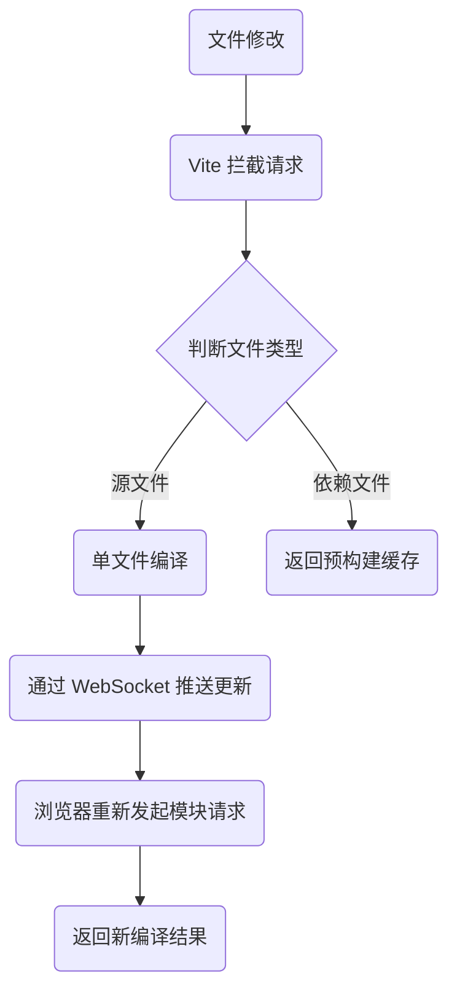

出处：[掘金](https://juejin.cn/post/7524641787418722343)

原作者：前端微白

---

> 在开发过程中节省的每一秒，都是对开发体验的重大提升 —— 尤雨溪（Vite 作者）

# 速度对比：直观的性能差异

先看一组实际项目的真实数据：

| 指标         | Webpack 5 (dev-server) | Vite 5     | 差距倍数 |
| ---------- | ---------------------- | ---------- | ---- |
| 冷启动时间      | 12.8s                  | 0.8s       | 16x  |
| CSS 更新延迟   | 350±50ms               | 20±5ms     | 17x  |
| JS 模块热替换延迟 | 1800±300ms             | 45±10ms    | 40x  |
| 内存占用峰值     | 1.2GB                  | 320MB      | 4x   |
| 热更新网络传输量   | 整个 chunk (≈300KB)      | 单个模块(≈5KB) | 60x  |

在大型项目中，这种差异会更加明显，Vite 的冷启动速度可以达到 Webpack 的 50-100 倍，HMR 更新快 50-300 倍！

> [!NOTE] 经典面试题：与理论不同，我的项目中为什么 Vite 反而比 Webpack 慢？
> 
> 答：Vite 会发起很多 HTTP 请求，HTTP/1.1 有队头阻塞问题，升级到 HTTP/2 解决
> 
> 详见 [[016.HTTP 各版本差异|HTTP 各版本差异]]

# 核心原理

## Webpack 的打包方式


这种==全部打包再服务==的模式导致：

- 启动时：必须处理所有模块才能提供服务
- 更新时：即使微小改动也要重新构建大部分模块

## Vite 的按需编译模式



这种模式的创新之处在于：

1. 启动时：仅启动开发服务器，零打包
2. 请求时：按需编译单个文件
3. 更新时：仅编译修改的文件及直接依赖

# 性能优化对比：Webpack VS. Vite

## 冷启动过程分析

### Webpack



### Vite



## 热更新 (HMR) 对比

### Webpack

基于 Bundle 的级联更新



性能瓶颈：依赖图谱越大，重建依赖图谱 → 增量编译模块 → 生成补丁文件阶段耗时指数级增长（实测 1000 模块项目平均耗时 1.8s）

```js
// 典型 webpack HMR 处理流程
compiler.hooks.done.tap('HMRPlugin', (stats) => {
  const changedModules = Array.from(stats.compilation.modifiedModules);
  const chunks = changedModules.map(module => 
    Array.from(module.chunks).map(chunk => chunk.id)
  );
  server.sendMessage(client, { type: 'update', chunks });
});
```

核心缺陷：修改一个文件需重新计算整个依赖链

### Vite

基于 ESM 的按需编译

- ES Module 是编译时静态加载（`import/export`），支持 Tree-shaking
- CommonJS 是运行时动态加载（`require/module.exports`），无法静态优化



性能密钥：跳过依赖图谱遍历，单文件编译速度比 Webpack 快 10x（实测 1000 模块项目耗时 <100ms）

```js
// Vite 的 HMR 边界处理（伪代码）
function handleHotUpdate({ modules }) {
  const updates = modules.map(mod => ({
    type: 'js-update',
    path: mod.url,
    timestamp: Date.now()
  }));
  ws.send(updates);
}

// 浏览器的动态加载
import(`/src/component.js?t=${Date.now()}`).then(newModule => {
  newModule.render.applyUpdate();
});
```

突破点：每个模块是独立网络请求，无级联更新

# 关键技术深度解析

## 原生 ES 模块 (ESM) 的运用

Vite 直接利用浏览器原生支持的 ES 模块系统：

```html
<!-- index.html -->
<script type="module" src="/src/main.js"></script>
```

```js
<!-- main.js -->
import { createApp } from 'vue'
import App from './App.vue' // 浏览器直接请求 App.vue 文件

createApp(App).mount('#app')
```

优势：

- 零打包启动：开发服务器即时启动
- 按需加载：仅编译当前屏幕需要的模块
- 高效缓存：浏览器缓存未更改的模块

## 闪电般的依赖预构建

Vite 使用 Go 编写的 esbuild 处理依赖预构建：

```js
// vite.config.js
export default {
  optimizeDeps: {
    // 需要预构建的依赖项
    include: ['react', 'react-dom', 'lodash-es']
  }
}
```

esbuild 的优势：

- 用 Go 编写，直接编译为本地机器码
- 并行处理，利用多核 CPU
- 比 JavaScript 构建工具快 10-100 倍

| 工具      | 处理速度 | 语言  | 并发支持 |
| ------- | ---- | --- | ---- |
| esbuild | 极快   | Go  | 是    |
| Babel   | 中等   | JS  | 有限   |
| Terser  | 慢    | JS  | 有限   |

## 高效的热模块更新 (HMR)

Webpack 的 HMR 瓶颈：

- 需要重建整个模块图
- 更新速度随项目增长而下降

Vite 的 HMR 优化：

```js
// Vite 的 HMR API
import.meta.hot.accept(['./dep.js'], ([newDep]) => {
  // 当 dep.js 更新时执行
  updateComponent(newDep);
});
```

核心优化：

- 基于 ESM：精确的边界更新
- 只使修改的模块失效
- 利用浏览器缓存未更改模块
- 更新传播时间与项目大小无关

## 基于路由的异步拆分

生产构建时，Vite 使用 Rollup 进行优化：

```js
// 自动代码拆分示例
export default defineConfig({
  build: {
    rollupOptions: {
      output: {
        // 自动代码分割策略
        manualChunks(id) {
          if (id.includes('node_modules')) {
            return 'vendor';
          }
        }
      }
    }
  }
})
```

构建优化特点：

- 预配置优化的 Rollup 构建
- 更快的源映射生成
- 更智能的代码拆分策略
- 支持 WebAssembly 和 Web Workers

# 何时选择 Vite 或 Webpack？

| 场景                 | Vite 优势 | Webpack 优势 |
| ------------------ | ------- | ---------- |
| 新项目启动              | ✅ 极快    | ⚠ 慢        |
| 大型项目开发体验           | ✅ HMR极快 | ⚠ HMR变慢    |
| 复杂自定义构建            | ⚠ 有限制   | ✅ 高度灵活     |
| 需要兼容旧浏览器           | ⚠ 需插件   | ✅ 开箱即用     |
| 微前端架构              | ✅ 原生支持  | ⚠ 复杂配置     |
| 需要大量 loader/plugin | ⚠ 生态年轻  | ✅ 成熟生态     |

# Vite 优化配置实战

## 加速依赖预构建

```js
// vite.config.js
export default {
  optimizeDeps: {
    // 强制提前预构建
    include: ['lodash-es', 'axios'],
    
    // 排除不需要预构建的
    exclude: ['@monorepo/shared'],
    
    // 启用性能监听
    plugins: [visualizer()]
  },
  build: {
    // 使用更快的压缩工具
    minify: 'esbuild'
  }
}
```

## 提升 HMR 性能

```js
// 自定义 HMR 处理
if (import.meta.hot) {
  import.meta.hot.accept('./math.js', (newModule) => {
    console.log('Math module updated:', newModule);
    // 执行精确更新逻辑
  });
}
```

## 优化生产构建

```js
export default {
  build: {
    // 更快的打包输出
    target: 'esnext',
    
    // 开启 gzip 压缩
    brotliSize: true,
    
    // 移除 console
    terserOptions: {
      compress: { drop_console: true }
    }
  }
}
```

# Vite 的进化方向

1. Rust 编译工具链替代：Rolldown（Rust 版 Rollup）HMR 速度再提 50%
2. Lightning CSS 集成：替代 PostCSS 的 Rust 实现
3. 全局 CSS 优化：改进 CSS 代码分割
4. 服务端渲染增强：更快的 SSR 构建
5. Wasm 优化：原生 WebAssembly 支持
6. 插件标准化：统一 Rollup 和 Vite 插件

# 小结

Vite 的高性能源于几个根本性创新：

1. 拥抱浏览器标准：直接使用 ESM
2. 按需编译：不打包不编译不需要的代码
3. 原生性能工具：利用 esbuild 等非 JS 工具突破性能瓶颈
4. 精确更新策略：HMR 只需处理变更影响的最小范围

> "Webpack 是打包优先的，而 Vite 是服务器优先的。这就是性能差异的根本原因"

迁移建议：

- 新项目首选 Vite
- 大型现有项目逐步迁移
- 依赖特殊 Webpack 插件的暂缓

Vite 代表了前端工具链的未来方向 - 通过利用现代浏览器特性和原生编译工具，实现了从量变到质变的开发体验跃升
