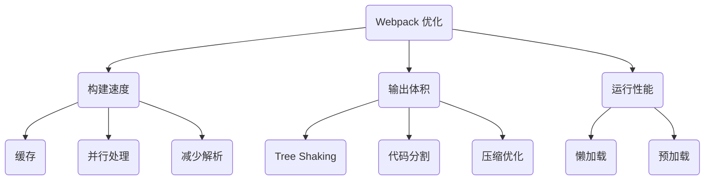

出处：[掘金](https://juejin.cn/post/7526182008528666658)

原作者：前端微白

---

# 核心优化全景图



# 闪电级构建优化

## 1. 精准狙击：限定 Loader 作用范围

Babel 转换是性能黑洞（[华为云社区研究](https://bbs.huaweicloud.com/) 指出其占构建时间 40%+）

```js
module.exports = {
  module: {
    rules: [
      {
        test: /\.js$/,
        // 关键配置：排除 node_modules
        exclude: /node_modules/,
        // 或精准包含
        include: path.resolve(__dirname, 'src'),
        use: ['babel-loader']
      }
    ]
  }
};
```

效果：10 万行代码项目构建时间从 12s → 6s

## 2. 多核轰炸：并行构建方案

传统单线程 VS. 现代并行处理对比：

| 方案            | 启动开销 | 适用场景         | 速度提升   |
| ------------- | ---- | ------------ | ------ |
| HappyPack（弃用） | 高    | Webpack4 及以下 | 30%    |
| thread-loader | 低    | 所有版本         | 50-65% |

```js
{
  test: /\.js$/,
  use: [
    {
      loader: 'thread-loader',
      options: { workers: require('os').cpus().length - 1 }
    },
    'babel-loader?cacheDirectory=true'
  ]
}
```

## 3. 持久化缓存：构建提速神器

Webpack5 内置文件系统缓存（相比 cache-loader 质的飞跃）

```js
module.exports = {
  cache: {
    type: 'filesystem',
    buildDependencies: {
      config: [__filename] // 配置文件变更时自动失效缓存
    },
    cacheDirectory: path.resolve(__dirname, '.webpack_cache')
  }
};
```

效果：二次构建时间 8s → 1.2s（3000+ 模块项目实测）

# 极致输出优化

## 4. Tree Shaking：精准消除死代码

实现条件（来自[极客文档](https://geek-docs.com/) 关键结论）：

1. 使用 ESM 模块规范
2. 开启生产模式
3. 避免副作用

```js
// package.json 标记无副作用
{
  "name": "your-project",
  "sideEffects": [
    "*.css",  // 需保留的副作用文件
    "*.scss"
  ]
}
```

陷阱案例：未标记副作用的工具库导致 200KB 无效代码残留

## 5. 智能分包：SplitChunks 策略优化

```js
optimization: {
  splitChunks: {
    chunks: 'all',
    cacheGroups: {
      // 拆分node_modules
      vendors: {
        test: /[\\/]node_modules[\\/]/,
        name: 'vendors',
        chunks: 'all'
      },
      // 业务代码分离
      commons: {
        minChunks: 2, // 被2个以上入口引用
        name: 'commons',
        priority: 10
      }
    }
  }
}
```

## 6. 资源压缩：升级压缩引擎

```js
const ESBuildPlugin = require('esbuild-webpack-plugin');

module.exports = {
  optimization: {
    minimizer: [
      // 替代 Terser，速度提升 10 倍
      new ESBuildPlugin({
        target: 'es2020',
        css: true  // 同时压缩 CSS
      })
    ]
  }
};
```

测试数据：`esbuild` 比 `terser` 快 7 倍，压缩 1000 文件：12s → 1.7s

# 运行时性能突破

## 7. 动态导入：按需加载艺术

基本用法：

```js
// 路由级代码分割
const ProductPage = lazy(() => import(/* webpackPrefetch: true */ './pages/Product'));

// 交互时加载
button.addEventListener('click', () => {
  import('./heavy-module').then(module => {
    module.runHeavyTask();
  });
});
```

进阶策略：

```js
// webpack 魔法注释
import(
  /* webpackPreload: true */      // 高优先级预加载
  /* webpackChunkName: "chart" */ // 命名 chunk
  './ChartComponent'
);
```

## 8. 资源预加载：速度感知优化

预加载类型对比表：

| 类型         | 优先级 | 适用场景      | 网络占用      |
| ---------- | --- | --------- | --------- |
| prefetch   | 低   | 未来可能使用的资源 | 空闲带宽      |
| preload    | 高   | 当前路线关键资源  | 立即请求      |
| preconnect | 最高  | 跨域请求提前建联  | DNS + TCP |

# 进阶优化组合拳

## 9. 资源 CDN：静态文件加速

```js
output: {
  publicPath: 'https://cdn.example.com/assets/',
},
externals: {
  // 分离 React 等大型库
  'react': 'React',
  'react-dom': 'ReactDOM'
}
```

```html
<!-- HTML 中 CDN 引入 -->
<script crossorigin src="https://unpkg.com/react@18/umd/react.production.min.js"></script>
```

优化效果：

- 首次加载减少 1.2MB
- TTI（可交互时间）提升 40%

## 10. 构建分析：可视化优化

使用 `webpack-bundle-analyzer` 定位问题：

```js
const BundleAnalyzer = require('webpack-bundle-analyzer');

module.exports = {
  plugins: [
    new BundleAnalyzer.BundleAnalyzerPlugin({
      analyzerMode: 'static',
      reportFilename: 'bundle-report.html'
    })
  ]
};
```

分析要点：

- 单个 >500KB 的文件
- 重复依赖库
- 未被 Tree Shaking 的模块

# 最佳实践策略

按项目规模推荐优化组合：

| 项目规模                  | 必选方案            | 推荐方案                   | 可选方案   |
| --------------------- | --------------- | ---------------------- | ------ |
| 小型项目  <br>(<50 模块)    | 缓存  <br>基础压缩    | 作用域限定                  | DLL 分离 |
| 中型项目  <br>(50-500 模块) | 持久化缓存  <br>并行构建 | Tree Shaking  <br>代码分割 | CDN 加速 |
| 大型项目  <br>(>500 模块)   | 多级缓存  <br>分布式构建 | 动态导入 <br>SWC 编译        | 微前端拆分  |

> 2025 前沿方案：基于 Rust 的 Turbopack 在 Monorepo 场景下比 Webpack 快 7 倍，但生态成熟度仍是瓶颈

# 避坑指南：性能反模式

1. 过渡拆分反模式：将 axios 拆成独立 chunk 导致请求瀑布流
2. 无效缓存配置：未排除 `node_modules` 的 babel-loader
3. 错误 Tree Shaking：未标记副作用的 CSS 导致样式丢失

```js
// 错误配置案例 ❌
{
  test: /\.css$/,
  sideEffects: false // 导致样式被 shaking 掉！
}
```

优化需权衡，监控先行！推荐集成 `speed-measure-webpack-plugin` 持续跟踪构建指标，避免过度优化带来维护负担
