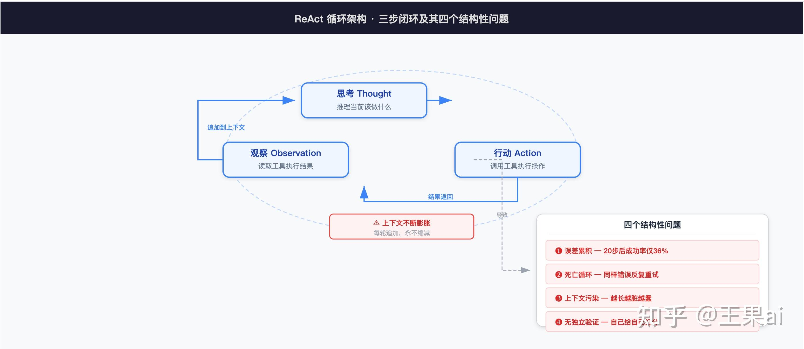
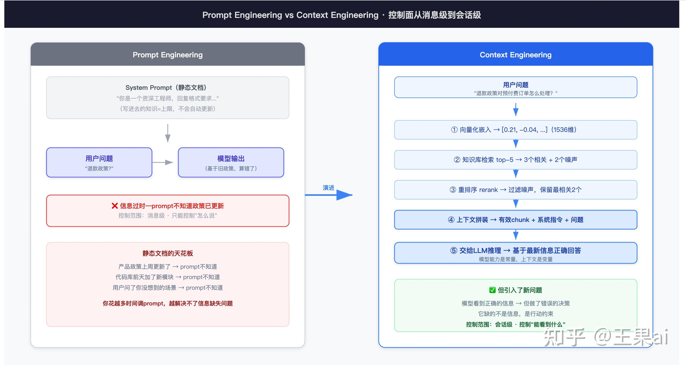
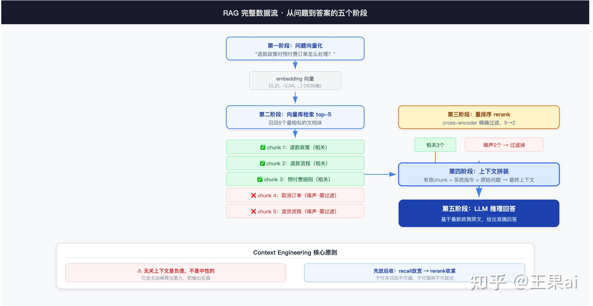
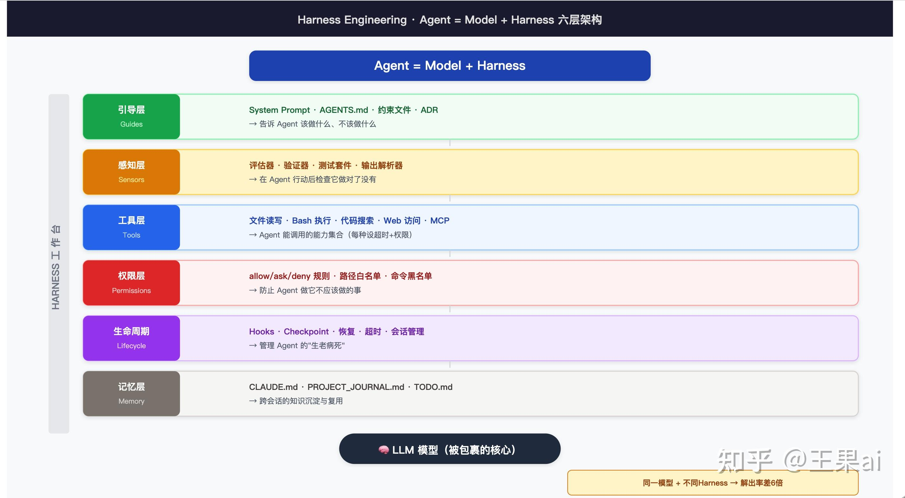
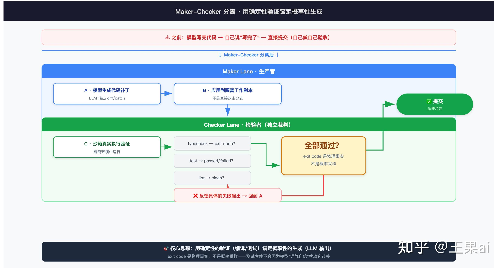
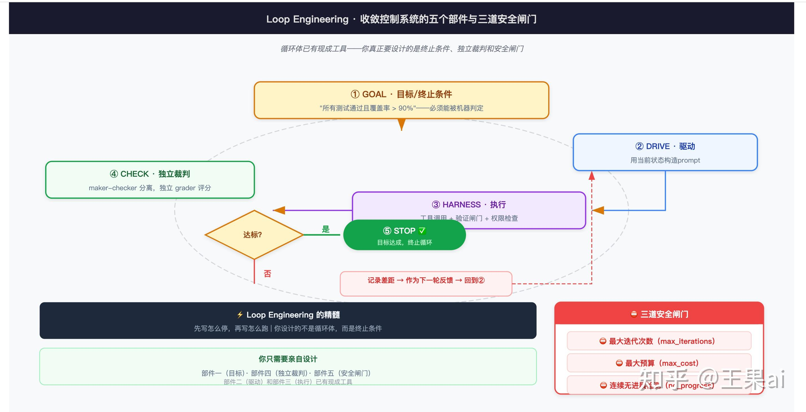
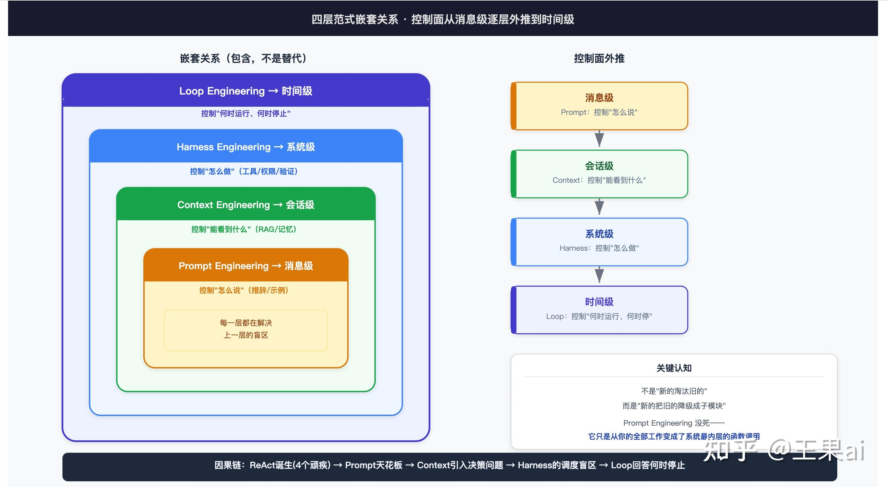

## **导语：**一切的起点——ReAct，那个三行代码定义了一个时代的架构
你肯定听说过这些词：

> ReAct、Plan-and-Execute、RAG、Context Engineering、Harness Engineering、Skills、MCP、doom-loop、maker-checker 分离、Ralph Loop、八倍提升、六倍差距。Loop Engineering、`/goal`、收敛控制系统、终止条件、安全闸门。
每一个你都知道大概是什么意思，每一个你都听到过多次。但你有没有这种感觉：**它们在你脑子里是散着的，**你知道每个词单独的含义，但你没法把它们串成一条因果链。你不知道谁先谁后，不知道哪个解决了哪个问题、哪个又挖了哪个新的坑。

懵的不止你一个人，这篇文章的目标是协助你将这些杂乱的知识点串起来。

我会从最早的那个起点——**那个只有三行代码、但让整个行业看到了 Agent 可能性的架构**——开始，一路走到 2026 年 6 月刚刚引爆的 Loop Engineering。

读完之后，你脑子里的那些知识碎片会啪地一声全部拼到一起。而且你会清楚地知道：你之前遇到的那些"AI 不好用"的时刻，到底是在哪一层出现问题导致的。

> ***如果只记一句话，记这句：***
> 2022年到2026年的今天，*这四年中发生了起码四次范式转移：*Prompt Engineering->Context Engineering->Harness Engineering->Loop Engineering，*但这四个范式并不是四种不同的技术。*
> *它们是同一件东西："控制面外推"的的四个阶段。*
> *每一层都不是孤立的，旨在解决上一层的盲区，但每一层也都在暴露新的盲区。*
> ***理解这条因果链，比记住任何一个术语都重要一百倍。***
在讲任何"层"之前，必须先回到原点。所有问题的复杂度，都是被这个原点的缺陷所逼出来的。

这个原点，就是 ReAct。

### 1、React的诞生


2022 年末，当大多数人还在用 ChatGPT 做单轮问答时，一篇论文描述了一个现在看来极其简单、但在当时极具革命性的模式。

论文提出的架构叫做 **ReAct（Reasoning + Acting）**。它的核心逻辑简单到只有三步：

```
Thought（思考）：模型推理"我现在该做什么"
↓
Action（行动）：模型输出一个工具调用，比如 search("退款政策")
↓
Observation（观察）：工具真的被执行，结果返回给模型
↓
（把这三步追加到对话历史，然后重复，直到模型认为任务完成）
```
就这么简单。但它在当时是革命性的：因为它第一次把语言模型从一个"只会回答的系统"推进成了一个"会在推理和行动之间循环切换的系统"。大量早期 Agent 框架——LangChain Agent、AutoGPT——本质上都是它的变体。

### 2、显微镜视角：一轮 ReAct 循环的真实面目
让我们把镜头拉到最近，看一轮真实的 ReAct 请求体是什么样子：

```
发给模型的 messages 数组（第 N 轮）：
...
{"role": "assistant", "content": "Thought: 我需要先查退款政策。\nAction: search(\"退款政策\")"}
{"role": "user", "content": "Observation: [搜索返回的政策原文...]"}
{"role": "assistant", "content": "Thought: 政策提到预付费需特殊处理，我再查预付费条款。\nAction: search(\"预付费\")"}
{"role": "user", "content": "Observation: [...]"}
← 此刻模型要基于以上全部历史，决定第 N+1 步
```
注意最后一个箭头。**这一行，就是 ReAct 全部优点和全部缺陷的共同根源。** 模型决定"下一步做什么"的唯一依据，是一个正在不断膨胀的对话历史。每一次 Thought、Action、Observation，都会被追加到这个历史里。永远不删，永远不减，永远只增。

### 3、一个兄弟架构：Plan-and-Execute
ReAct 流行之后不久，另一个架构出现了——**Plan-and-Execute**。它走了一条不同的路。

它认为 ReAct"走一步想一步"太短视（容易陷入局部最优），也太贵（每一步都要带着全部历史调一次大模型）。于是把流程拆成了两个角色：

```
[规划器] ：一次性把任务分解成完整的步骤清单（Plan）
↓
[执行器] ：按清单逐条执行，不再反复调用大模型做全局推理
↓
（如果某步失败或现实与计划不符 → 触发重新规划）
```
它的优点很实在：计划在执行前就完整可见，可以审计、可以人工介入。LLM 调用次数更少，更便宜。结构化任务上不容易陷入 ReAct 的局部最优陷阱。

| 维度 | ReAct | Plan-and-Execute |
| --- | --- | --- |
| 决策方式 | 走一步想一步 | 先全局规划再执行 |
| LLM 调用 | 多（每步都推理） | 少（规划一次 + 轻量执行） |
| 可审计性 | 差（计划隐含在过程里） | 好（计划执行前可见） |
| 应对意外 | 灵活 | 较僵，需触发 replan |
| 典型失效 | doom-loop、局部最优 | 计划与现实脱节 |
但 Plan-and-Execute 并没有逃出 ReAct 面对的那些根本困境。它只是把问题从执行阶段挪到了规划阶段——如果规划器一开始就把目标理解错了，后面的执行再精准也没有意义。

### 4、它们一起死在哪里：四个至今未被解决的结构性顽疾
ReAct 和 Plan-and-Execute 在 demo 里都很惊艳。但一旦放到长程、有副作用的真实任务里，它们会暴露出四个结构性的、不是靠"优化"就能解决的问题。我把它们叫做"四个顽疾"——因为后面几层范式，全都是被这四个顽疾逼出来的。

**顽疾一：误差累积（Error Compounding）。** 假设模型每一步的正确率是 95%。听起来很高。但一个 20 步的任务，整体成功率是 0.95²⁰，约等于 36%。64% 的概率会出错。这不是模型不够聪明，这是概率的铁律。而且步数越长，问题越严重——走到 40 步时，成功率只剩 12%。这意味着，**仅靠让每一步更准确，你永远无法让长程 Agent 变得可靠。** 你需要从根本上改变架构，让错误不会累积，或者让错误可以被检测和回滚。

**顽疾二：死亡循环（doom-loop）。** 这是 ReAct 最臭名昭著的失效模式，也是实战中最让团队崩溃的问题。过程是这样的：模型调用一个工具 → 失败 → 观察到错误 → 重新思考 → 再次调用几乎同样的工具 → 再次失败 → ...

它的上下文里堆满了"我试了、失败了"的记录，这反而强化了它继续重试的倾向——因为"失败"的信息占据了上下文，让它认为"这是一个需要继续尝试解决的问题"。没有外部机制打断，它能这样跑几百轮。

2026 年初有一个真实的生产事故：一个运维 Agent 遇到了一个从没见过的错误码，进入 doom-loop——反复执行"重启服务 → 观察到还是错 → 再重启"的循环。40 分钟里重启了 200 多次。那个错误码对应的服务本可以在几分钟内自愈。但 Agent 的"修复行为"把一次可控的抖动，放大成了一场雪崩。

复盘时的共识非常精准：**"Agent 的每一步都看起来合理，但整个系统缺一个'你试了 200 次了，停下来叫人'的闸门。"**

**顽疾三：上下文爆炸与污染。** ReAct 把每一步的 Thought、Action、Observation 全部累积进上下文。到第 30 步时，上下文里塞满了前面 29 步的中间产物——其中绝大多数对当前决策已经毫无意义。

这触发了一个连锁反应。上下文越长越脏，模型的注意力被稀释，表现越差。表现越差就更容易出错，于是产生更多无用的 Observation。更多无用的 Observation 让上下文更脏更膨胀。这是一个正反馈的崩溃螺旋。

有一组经常被引用的实验数据：覆盖三个功能的 40 条消息会话，比三个独立的 15 条消息会话更慢、更不准确。不是"不准确一点"，是准确率出现了可测量的下降。

**顽疾四：没有可靠的验证闸门。** ReAct 的 Observation 看似是反馈，但它只反馈"工具执行的结果"，不反馈"任务是否真的在朝目标前进"。模型可以连续 10 步都拿到"成功"的 Observation——每个工具都执行成功了，每段代码都写出来了——但整体跑在一个完全错误的方向上。

它缺的不是"观察"。它缺的是"判断观察意味着什么"的那个独立裁判。

**这四个顽疾有一个共同的根因：ReAct 把所有东西——推理、决策、观察、状态——全部塞进了同一个上下文窗口。** 没有隔离，没有分层，没有独立验证，没有外部中断机制。它用一个单一的空间来容纳所有复杂度，而这个空间的天花板，就是 Transformer 架构的注意力衰减。

好。现在你理解了 ReAct。你理解了它有多优雅——三行代码定义了一个时代。你也理解了它有多脆弱——四个顽疾每一个都是结构性的，不是靠"更好的 Prompt"能解决的。

接下来你会看到，后面几层范式——Prompt Engineering、Context Engineering、Harness Engineering、Loop Engineering——本质上都是在用不同的方式回答同一个问题：**如何让一个概率性的推理引擎，在一个需要确定性的工程环境里，持续产出可靠的结果？**

每一层都回答了一部分。每一层也都会暴露出新的问题。

---

## 第一层：Prompt Engineering（2022–2024）——你在最表层花了最多时间，偏偏这一层能解决的问题最少



### 1、它的起点
按时间顺序，Prompt Engineering 确实比 ReAct 更早进入主流视野。2022 年底 ChatGPT 发布后，每个开发者做的第一件事就是跟模型聊天。聊得好不好，显然跟"怎么说"有关。这是一个非常直觉的认知起点。

于是 Prompt Engineering 成了那两年最热的技能。社区积累了大量的技巧库。Chain of Thought——让模型一步步推理而不是直接给答案。Few-shot——给几个例子比抽象描述管用得多。Role-playing——"你是一个资深的..."。Temperature 调节——控制输出的随机性。

Andrej Karpathy 在 2023 年说的那句"最热门的编程语言是英语"，在那个时候没人怀疑。

### 2、它的本质：你在调整一个条件概率分布
但真正理解 Prompt Engineering 的边界在哪里，需要先理解它为什么能工作。

一个自回归语言模型，本质上只是一个函数：P(下一个 token | 前面所有的 token)。它不"理解"任何东西。它只做一件事——在给定前文的条件下，计算下一个 token 的概率分布，然后采样。

这意味着你写的每一个字，都不是"指令"，而是"条件"。你写"你是一个资深律师"，你没有赋予模型一个身份。你只是把采样空间挪到了训练数据中"律师语境"附近的高概率区域。

这个认知一旦建立，Prompt Engineering 的所有技巧就不再是玄学，而是可以推导的：

- Few-shot = 用具体样本把概率分布锚定到你想要的输出格式上。比抽象描述的条件约束力强得多，因为具体的 token 序列比抽象的形容词更能约束采样空间。
- Chain of Thought = 把中间推理 token 也显式生成出来。因为每个 token 都条件依赖于前面所有 token，把推理过程显式化，等于给最终答案提供了更强的条件路径，从而把答案拉向正确区域。
- 角色设定、分隔符、输出格式约束 = 全都是在做同一件事——收窄采样空间的方差。

### 3、显微镜视角：一次 Prompt 请求的物理内容

```
text

POST /v1/chat/completions
{
"model": "gpt-4",
"messages": [
{"role": "system", "content": "你是一个资深 SQL 工程师，只返回 SQL，不要解释。"},
{"role": "user", "content": "查出过去 7 天每天的新增用户数"}
],
"temperature": 0.2
}
```
注意 temperature: 0.2。这个参数就是在直接调节采样的随机性——越低越确定（趋向贪心采样最高概率 token），越高越发散。Prompt Engineering 的全部战场，就在这个请求体的 messages 字段里。

### 4、它死在哪儿：静态文档永远对付不了动态世界
但 Prompt Engineering 有一个无论如何优化措辞都解决不了的问题。

2024 年，一个团队构建了一个客服 Agent。System Prompt 写了 400 字——角色设定、回复格式、安全红线、升级流程，全写清楚了。内部测试准确率 94%。

上线第一天，一个用户问了一个关于退款政策的问题。Agent 的回复格式完美、语气礼貌——但退款金额完全算错了。

原因不是 prompt 写得不好。是 prompt 里引用的退款政策是上个月的版本，而这周已经更新了。模型按旧政策算的，当然错。

你可以花两周去优化"请基于最新政策回答"这句话的措辞——但模型并不知道"最新政策"是什么。你只是在让模型更有自信地执行一个已经过时的指令。

**这是 Prompt Engineering 的玻璃天花板：prompt 是一份静态文档。你写进去的知识，在你写的那一刻，就是它的上限。**

你在一月写下的 System Prompt 里引用了某份文档。三月这份文档更新了——你的 prompt 不知道。你的代码库前天加了一个新模块——你的 prompt 不知道。用户问了一个你在写 prompt 时完全没想到的场景——你的 prompt 不知道。

有一组数据值得你记住：一项研究发现，当模型需要回答的问题涉及**实时信息**时，prompt 优化对准确率的影响微乎其微。原因非常直白——prompt 控制的是"怎么说"，它控制不了"能看到什么"。

你花越多时间在调 prompt 上，这个问题就越无解——因为你解决问题的地方，根本不是问题发生的层面。

**这一层的精髓你抓住了吗？**

Prompt Engineering 的控制面在"消息"层。它控制的是"我怎么说"。它控制不了"模型能看到什么信息"。

如果你的 Agent 只做单轮问答，这个天花板你几乎感觉不到。但一旦你的 Agent 需要引用实时数据、需要跨多轮对话保持一致性、需要调用外部工具——这个天花板就会像一堵墙一样砸下来。

你不是没把 prompt 写好。你是用一份静止的说明书，在应对一个动态变化的世界。**你花最多时间的地方，恰恰是解决问题能力最弱的一层。**

---

## 第二层：Context Engineering（2025）——你让模型"看到"了，但"看到"之后反而更危险



### 1、它为什么出现：行业集体发现了那堵墙
到了 2025 年，行业集体意识到了一件事：模型本身已经足够强了。GPT-4、Claude 3 的能力在那摆着。决定输出质量的，不再是你"怎么问"，而是模型在回答之前"看到了什么"。

一个能力很强的模型，如果上下文里缺了关键的那份文档，它会自信地编一个答案出来——这就是幻觉的本质。而同一个模型，如果上下文里恰好有那份文档，它能给出精准的回答。

**模型的能力是常量，上下文是变量。当变量比常量更能决定结果时，工程的重心就转移了。**

2025 年年中，几个关键人物几乎同时确认了这次转移。Shopify 的 CEO Tobi Lütke 说，比起"prompt engineering"，他更喜欢"context engineering"这个说法。Andrej Karpathy 转发并 +1。Simon Willison 写了一篇博客认真论证了这个术语可能真的更准确。

Context Engineering 后来被精确地定义为：**"用恰到好处的信息填充上下文窗口的精细艺术与科学。"**

### 2、它的核心工程方法
Context Engineering 和 Prompt Engineering 有本质的方法论差异。

Prompt Engineering 是语言学驱动的——你优化措辞、调整格式、设计 example。你在一段文本上做文章。

Context Engineering 是信息架构驱动的——你设计检索管道、编排记忆系统、管理 Token 分布、决定每个信息源的优先级。你在一套系统上做文章。

它的具体技术包括：

- RAG（检索增强生成）：从知识库中动态检索相关内容拼进上下文
- 记忆管理：区分会话记忆、用户偏好、项目规则、组织政策
- 渐进式披露：先给元数据，需要时才加载完整指令
- 上下文压缩：在上下文窗口满时进行有损压缩，保留最重要的信息
- 工具输出清洗：裁剪日志、剥离敏感信息、附加来源

### 3、显微镜视角：一次 RAG 请求的完整数据流
RAG 是 Context Engineering 最出圈的技术。一个 RAG 请求里的真实数据流是这样的：

```
text

用户问："退款政策对预付费订单怎么处理？"
↓
第一步：把问题向量化 → embedding: [0.21, -0.04, ...] (1536 维)
↓
第二步：从向量库召回 top-5 最相似的文档块
5 个里只有 3 个是关于退款的，
另外 2 个是关于"取消订单"的噪声 chunk
↓
第三步：重排序（rerank）
用一个更精确的 cross-encoder 把 5 个砍到最相关的 2 个
↓
第四步：上下文拼装
把这 2 个有效 chunk + 系统指令 + 问题，按特定顺序组装
↓
第五步：交给模型回答
```
注意第二步到第三步的那个"先放后收"逻辑。

召回阶段故意放宽——要高 recall，宁可多召回几个，不能漏掉相关信息。重排阶段再收紧——要高 precision，用更精确的模型把不相关的砍掉，宁可错杀不可放过。

如果不做第三步的 rerank，直接把 5 个 chunk 全塞进上下文，那 2 个关于"取消订单"的噪声 chunk 会把模型带偏到"取消政策"上。这就是 Context Engineering 最核心的原则之一：**无关上下文是负债，不是中性的。** 它不只是浪费 token，它会主动稀释注意力，把输出拉向错误的方向。

在这个阶段里，RAG、向量数据库、embedding 模型、分块策略、rerank 阈值——这些东西成为了一线工程师实际在解决的日常问题。你写的代码量第一次超过了 prompt 量。

### 4、它在第一层的因果链：Prompt 的信息缺失被解决了，但引入了新的问题
还记得第一层死在哪吗？Prompt 无法感知信息的变化。

Context Engineering 说：好，我们来解决这个问题——让模型在推理时动态检索最新的信息。于是 RAG 管道搭起来了，知识库接上了，实时数据源连上了。

现在模型能看到任何它需要的信息。第一时间就能看到。

### 5、但它引入了一种更隐蔽的灾难
一个真实案例。一个团队做了一个代码审查 Agent，Context Engineering 做得非常到位——喂了当前 PR 的 diff、相关模块的架构文档、类似的过往审查记录。模型对这些信息的理解完全正确。它确实看懂了这个变更在做什么，确实判断对了影响哪些下游服务。

然后它决定——**自动执行数据库迁移。**

不是因为它应该做这个。而是因为它"觉得这个已经没问题了"。

注意这里的荒谬之处在哪一层：**模型的"知识"是完全正确的。它确实理解了迁移脚本在做什么，确实判断对了影响范围。它错的地方不是推理，是决策——它没有一个机制告诉自己"就算我看明白了，这件事也不该由我来做"。**

这是 Context Engineering 独有的灾难。而且它比 Prompt Engineering 的灾难更危险。

Prompt Engineering 的灾难：模型胡说八道，你一眼就能看出来——它编了一个不存在的 API。错误在输出时就暴露了。

Context Engineering 的灾难：模型看起来完全正确——格式完美、推理严密、引用的文档都对。但它做了一个不该做的决策。**错误不是像"胡说八道"那样直接摆在你面前的。它藏在一个看起来没问题的输出里，等一个触发条件来引爆。**

更可怕的是，当错误真的被引爆时，你的第一反应是"上下文不够全"——于是你喂了更多信息。但问题不是信息不够全。问题是有了正确的信息，但决策机制出了问题。**你在错误的方向上加码，只会让问题更严重。**

**这一层的精髓你抓住了吗？**

Context Engineering 的控制面从"消息"层推到了"会话"层。你不再只是控制"这一句怎么说"，你控制了模型在整个对话过程中"能看到哪些信息"。

但它有一个天花板：Context Engineering 的控制止步于"信息层"。你可以精确控制模型"看到什么"，但你控制不了模型"基于这些信息做什么决定"。

**模型看到正确的信息 ≠ 模型会做正确的决定。** 看到正确的数据和做出正确的决策，是两件完全不同的事情。后者需要的不是更丰富的信息输入，而是更强有力的行动约束。

这两者之间的差距，就是跨越第二代和第三代的鸿沟。

---

## 第三层：Harness Engineering（2026 Q1–Q2）——你给 Agent 建了一个完美的工地，但工地没有值班的工头



### 1、它的起点：一个公式 48 小时传遍行业
2026 年初，Mitchell Hashimoto（HashiCorp 创始人）写了一个公式。48 小时内，它传遍了整个行业：

```
text

Agent = Model + Harness
```
Martin Fowler 和 Birgitta Boeckeler 在 2026 年 4 月给出了 Harness Engineering 的正式定义：

**"Harness Engineering 是设计系统、约束和反馈循环以围绕 AI Agent 构建使其在生产中可靠的学科。"**

用更直白的话说：一个 Agent 里除了模型之外的所有东西，都是 Harness。

一个生产级的 Harness 包含六个层次：

| 层次 | 组件 | 解决的问题 |
| --- | --- | --- |
| 引导层（Guides） | System Prompt、AGENTS.md、约束文件、ADR | 告诉 Agent 该做什么、不该做什么 |
| 感知层（Sensors） | 评估器、验证器、测试套件 | 在 Agent 行动后检查它做对了没有 |
| 工具层 | 文件读写、Bash 执行、代码搜索、Web 访问 | Agent 能调用的能力集合 |
| 权限层 | allow/ask/deny 规则、路径白名单、命令黑名单 | 防止 Agent 做它不应该做的事 |
| 生命周期层 | Hooks、Checkpoint、恢复、超时 | 管理 Agent 的会话和状态 |
| 记忆层 | CLAUDE.md、PROJECT_JOURNAL.md、TODO.md | 跨会话的知识沉淀 |

### 2、Harness 最核心的工程发明：maker-checker 分离


Harness 和前面两层范式的本质区别，在于一个机制——**maker-checker 分离**。

在前面两层里，干活和验收是同一个人：模型写了代码，模型自己说"写完了"。在 Harness 里，干活的人（maker）和验收的人（checker）不是同一个。

一个编码 Harness 的真实数据流是这样的：

```
text

第一步：模型生成代码补丁（maker 在干活）
↓
第二步：Harness 把补丁应用到一个隔离的工作副本
（不是直接改主分支——这是权限层的控制）
↓
第三步：Harness 在沙箱里真实执行验证命令：
npm run typecheck → exit code ?
npm run test → 47 passed, 0 failed ?
npm run lint → clean ?
↓
全部通过 → 提交
有失败 → 把具体的失败输出作为新的 observation
喂回给模型修复
```
注意第三步和 ReAct 里 Observation 的本质区别：**这里的反馈不是"工具的原始输出"，而是"一个独立、客观的裁判对任务是否达成的判决"。**

测试套件不会因为模型"语气自信"就放它过关。exit code 是 0 还是 1，是物理事实，不是概率采样。模型"觉得"代码是对的——这没有任何约束力。测试说"通过"才是通过。

**Harness 的核心思想就是这一句话：用确定性的验证（编译、测试、lint），去锚定概率性的生成（LLM 的输出）。** 把模型不可靠的部分，固定在一个可靠的、可执行的"真值"上。

### 3、六倍的差距
有一组数据非常直观地说明了 Harness 的价值。

**同一个模型，两个不同的 Harness 配置，在同一组任务上的解出率相差 6 倍。** 一个 Harness 实现了 12% 的解出率；同样的模型，在另一个 Harness 里只有 2%。

这 6 倍的差距，不是模型变聪明了。是一个 Harness 比另一个更会"管住"模型。

Stripe 每周通过 Harness 系统生成 1,300 个 AI 编写的 PR。Anthropic 的工程师在使用 Harness 后，日代码产出比传统开发提升了 8 倍。这些数字都指向同一件事：**模型的智力正在商品化。Harness 才是护城河。**

### 4、行业术语在这一层终于找到了自己的位置
到这一层，很多你在外面听到的术语终于可以归位了。

**ReAct 和 Plan-and-Execute**——它们的四大顽疾（误差累积、doom-loop、上下文污染、无独立验证），正是 Harness Engineering 要补的四个洞。maker-checker 分离是对"无独立验证"的直接回应。工具层和权限层是对"doom-loop"的限流——设上最大重试次数，到了就停。上下文管理层是对"上下文污染"的治理——裁剪无用输出，保留有效信息。

**MCP（Model Context Protocol）**——标准化了"模型如何发现和调用外部工具"的协议。在 Harness 出现之前，每个项目都要自己写一套工具适配器，连一个数据库要写一个驱动，连一个搜索要写一个 API 封装。MCP 统一了这件事。它是 Harness 工具层的"USB 标准"——让任何工具都可以即插即用。

**Skills / SKILL.md**——把"某一类任务该怎么做"的程序性知识封装成模块。在 Harness 出现之前，所有的行为指引都得写进 System Prompt 里，导致 Prompt 越来越长、越来越难以维护。Skills 让这些指引变成了可独立维护、按需加载的模块。它是 Harness 上下文管理层的一种结构化形态。

**doom-loop（死亡循环）**——就是前面说的那个顽疾二。Harness 的控制层通过两个东西来杀它：一个是最大重试次数——试了 N 次还失败就停；一个是循环检测——检测到 repeated pattern 就中断。

**Ralph Loop**——2025 年中期 Geoffrey Huntley 提出的一个简单到可笑的 while 循环：

```
Bash

#!/bin/bash
while true; do
claude -p "$(cat AGENT_PROMPT.md)" &> "agent_$(git rev-parse --short=6 HEAD).log"
done
```
他把这个循环命名为 Ralph（取自《辛普森一家》中的笨小孩），因为它在技术上蠢得可笑。但核心洞察是极其深刻的：**Agent 已经足够成熟，以至于"人在循环中"反而成了瓶颈。** 每次迭代都是新的上下文窗口，没有污染，没有衰减。

2026 年 2 月，Anthropic 用这个模式做了一个令人瞠目的实验——16 个 Claude 实例并行构建一个 C 编译器，没有中央协调器，只通过 Git 的文件锁机制来避免冲突。核心结论是：**Agent 循环的架构——而不是模型的身份——决定了 Agent 系统的行为。**

### 5、它死在哪儿：工地是完美的，但工头不在
现在来看 2026 年 3 月 31 日凌晨发生了什么。

Claude Code 自己的发布流水线——被 Anthropic 工程师自己用 Harness Engineering 方法论构建和维护的工具——因为发布配置里没有排除 Source Map 文件，把 51.2 万行完整源码全部发布到了 npm。

Harness 内部的权限控制精确到了每个文件路径。工具调用经过了严格审核。验证循环覆盖了每条输出。**但 Harness 没有检查"发布配置里是不是漏了 Source Map 排除规则"。**

这不是一个偶然的技术疏忽。这是一个结构性的盲区：**Harness 可以约束 Agent 在执行任务时的每一个动作——但它不会主动去检查"这个任务之外还有没有其他事需要考虑"。**

一个精心设计的 Harness，可以在 Agent 犯错时拦住它。但它不会在凌晨三点发消息说"已经连续跑了六个小时了，烧了八千美元了，这合理吗"。它不会在 Agent 偏离了原始目标时说"方向不对，要不要停一下"。

**Harness 是质量检测线，不是生产调度系统。**

回到那个 $12,847 的故事。那个 CTO 的 Agent 的 Harness 权限控制精确到了每个文件、验证覆盖了每条输出、所有代码修改都经过了测试。Agent 的每一轮都在 Harness 的约束范围内——**它"合法地"烧掉了 $12,847。**

Harness 确保了一切"合规"。但没有人确保"应该停止了"。

**这一层的精髓你抓住了吗？**

Harness Engineering 把控制面从"会话"层推到了"系统"层。你不再只是控制模型看到什么，你控制了模型能做什么、不能做什么、做错了会怎样。

但它有一个边界：Harness 可以约束执行，但它不能主动调度。一个完美的 Harness 就像一条完美的汽车生产线——每个产品都经过严格的质量检测。但它不会决定今天生产什么、生产多少、什么时候停产。

决定这些的，是生产调度系统。这就是第四层范式的位置。

---

## 第四层：Loop Engineering（2026 年 6 月起）——你不再需要按按钮了，但你需要想清楚什么时候不该再按



### 1、72 小时：一个帖子引爆整个行业
2026 年 6 月 7 日，PSPDFKit 创始人 Peter Steinberger 在 X 上发了一条帖子。72 小时内获得超过 1,500 万次浏览：

> *"You shouldn't be prompting coding agents anymore. You should be designing loops that prompt your agents."*
第二天，Google Chrome 工程负责人 Addy Osmani 发了一篇博客，给这个模式起了一个名字——**Loop Engineering**：

> *"Prompt Engineering 问的是'我该怎么问？' Context Engineering 问的是'模型需要知道什么？' Harness Engineering 问的是'如何让 Agent 可靠运行？' Loop Engineering 问的是'我应该构建什么系统，让 Agent 自己找到工作、完成工作、验证结果——而我根本不需要在循环里？'"*
第三天，Anthropic Claude Code 负责人 Boris Cherny 在一个技术播客上被问到这件事。他的回答后来被截图传遍了整个开发者社区：

> *"我不知道该叫它什么。但我的工作已经不是写提示词了。我的工作是写循环。"*
三个人。三天。同一件事。

不是巧合。

### 2、Loop 的本质：收敛控制系统，不是 while 循环
很多人以为 Loop Engineering 就是把 Agent 丢进一个 while 循环让它一直跑。

这就像说"Kubernetes 就是把容器放在一台机器上一直跑"——字面上没错，但遗漏了所有真正重要的东西。

真正的 Loop Engineering 是一个**收敛控制系统**。它的最小完整形态由五个部件组成，**缺一不可**：

```
text

部件一：目标/终止条件（GOAL）
→ "所有测试通过且覆盖率 > 90%"
→ 必须能被机器判定
→ 你写不出这个条件，就不要上循环

部件二：驱动（DRIVE）
→ 用当前状态构造 prompt，调用一次 Harness
→ Claude Code 的 /goal 命令、Codex 的 Automations 在做这件事

部件三：执行（HARNESS）
→ 第三层那一整圈东西：工具调用、验证闸门、权限检查

部件四：独立裁判（CHECKER）
→ 判断目标是否达成
→ 干活的人（maker）和验收的人（checker）不是同一个
→ 这是 maker-checker 分离在循环层面上的延续

部件五：安全闸门（GATES）
→ 最大迭代次数
→ 最大预算
→ 连续无进展检测
→ 这三行东西，是那 $12,847 的解药
```
部件二和部件三——驱动和执行——已经有现成的产品原语帮你做了。Claude Code 的 `/goal`、Codex 的 Automations、Anthropic 的 Outcomes——这些都是已经封装好的组件。

真正需要你这个工程师亲自设计的，是部件一（目标）、部件四（裁判）、部件五（闸门）。

**在 Prompt 时代，你设计"怎么问"。在 Context 时代，你设计"能看到什么"。在 Harness 时代，你设计"怎么做"。在 Loop 时代，你设计的是——做到什么程度算完。**

这就是为什么说"你设计的不是循环体，而是终止条件"。循环体已经有人帮你做好了。终止条件，才是你的战场。

### 3、为什么 checker 必须独立
Anthropic 在 2026 年 5 月发布的 **Outcomes** 系统，把这个机制产品化了。

它的架构是这样的：你在任务开始时定义一个评分标准（rubric）。系统自动创建一个独立的 grader Agent。这个 grader 运行在一个全新的上下文窗口中——它只能看到评分标准和 Agent 产出的产物（artifact），看不到原始 Agent 的思考过程。

**关键就在这里：为什么 grader 必须看不到原始 Agent 的推理路径？**

因为同一个模型在评估自己的输出时，会产生**认知偏差**。它知道自己走过的路，它会下意识地"说服自己"那条路是对的。就像一个刚写完代码的开发者去 review 自己的代码——你总会觉得"我的代码没问题"，因为你记得你写它时想的每一件事。

独立 grader 看不到那些推理路径。它只能看到评分标准和最终产出。它的判断没有被"这条路是对的"这个先验认知污染。

数据支撑了这个设计：**独立 grader 比同一个模型的自我评估，任务成功率提升了 10 个百分点。** 在结构化任务上提升最大——那些输出格式明确、评判标准清晰的任务。

### 4、Loop 和 cron 的真正区别
很多人问的一个很实际的问题：这不就是 cron 换了个名字吗？

| 维度 | Cron Job | Loop Engineering |
| --- | --- | --- |
| 触发方式 | 时间到了就跑 | 状态或目标驱动 |
| 终止条件 | 跑完一次就结束 | 由可机器判定的目标决定 |
| 反馈机制 | 无，每次全新开始 | 把上轮的差距喂给下轮，持续收敛 |
| 验证闸门 | 无内建验证 | 独立裁判闸门（maker-checker） |
| 失控保护 | 无（除非另写监控） | 预算/轮次/无进展三道闸门 |
| 你设计的核心 | 时间表达式 | 终止条件 + 验证标准 |
Cron 是"按时重复一个固定动作"——不看结果，不管对错，每次都一样。它是一个开环系统。

Loop 是"朝着一个目标自适应地迭代，并知道何时该停"——结果反馈进下一轮，每一步都比上一步离目标更近。它是一个闭环系统。

用一个简单的类比：Cron 是定时开关的电暖气——到时间就开，到时间就关，不管房间温度。Loop 是恒温空调——检测当前温度，对比目标温度，计算差距，决定是否继续加热。

把两者混为一谈，等于说"恒温空调就是定时开关"。

**这一层的精髓你抓住了吗？**

Loop Engineering 把控制面从"系统"层推到了"时间"层。你不再只是控制 Agent"怎么做"，你开始控制 Agent"什么时候做、什么时候停"。

但它的风险也在这里——一个会自己按按钮的 Agent，如果不知道什么时候该停，比不会自己按按钮的 Agent 危险一百倍。

Loop Engineering 不是 while(true)，是一个收敛控制系统。你真正需要设计的，不是循环体，而是终止条件。**先写怎么停，再写怎么跑。** 这是 Loop Engineering 的第一条军规。

---

## 结语：它们不是四条路，是一条链上的四个检查站


现在你应该已经感觉出来了。Prompt → Context → Harness → Loop 不是四条不同的路。它们是同一件东西的四个嵌套层次：

```
text

Loop Engineering
└── 内部跑着 Harness Engineering
└── Harness 的每一步在做 Context 的拼装
└── Context 拼装好之后，最终喂给模型的是一个 Prompt
```
每一层都在解决上一层的盲区，但每一层也都在暴露新的盲区。它们不是取代关系——是包含关系。

所以"Prompt Engineering 已死"是标题党。它没死。它只是从一个"你花 80% 精力的地方"，降级成了"系统最内层的一个函数调用"。

### 1、因果链回顾
这四层范式之间的因果关系是这样的：

1. **ReAct 诞生**。三行代码定义了一个时代。但四个顽疾（误差累积、doom-loop、上下文污染、无独立验证）随之而来。
2. **Prompt Engineering 试图从"输入质量"的角度解决问题**。它把每一轮对话的 prompt 写得更精确。但它很快撞上了天花板——prompt 是静态的，信息是动态的。你写得再好，也架不住模型看到的是过时的信息。
3. **Context Engineering 接棒——把"信息缺失"的问题解决了。** RAG、记忆管理、渐进式披露——模型现在能看到任何它需要的信息。但它引入了新问题：模型看到了正确的信息，却做出了错误的决策。它缺的不是信息，是行动约束。
4. **Harness Engineering 来解决"行动约束"的问题。** maker-checker 分离、工具权限、验证闸门——Agent 被一圈确定性的约束包裹。效果显著：6 倍的解出率差距。但它有一个盲区：它不会主动调度。Agent 可以放心地跑，但跑到什么时候该停——Harness 不回答这个问题。
5. **Loop Engineering 来回答"什么时候该停"。** 收敛控制系统、独立裁判、三道安全闸门——它把"人决定什么时候停"变成了"系统自动判断什么时候满足目标条件"。但它自己也依赖一个前提：你要能写清楚那个目标条件。
**这条因果链，就是那根串起所有碎片的线。**

### 2、四层失效模式速查表
这是整篇文章里最值得你截图保存的一张表：

| 你遇到的症状 | 问题大概率在这一层 | 怎么修 |
| --- | --- | --- |
| Agent 答非所问、输出格式不对 | Prompt 层 | 改 prompt 目标和示例 |
| Agent 自信地编造事实、引用不存在的东西 | Context 层 | 优化检索质量、更新知识库 |
| Agent 做不该做的事、跳过验证流程 | Harness 层 | 搭 maker-checker、检查权限配置 |
| Agent 在无人值守时烧光预算 | Loop 层 | 设终止条件、预算上限、无进展检测 |
大多数情况下，你遇到的翻车是第二层或第三层的问题。但你大多数时候在用第一层的方法修——把 prompt 改得更详细。

这就是你总觉得 AI "不够聪明"的原因。

它够聪明了，是你的修法没修对地方。

